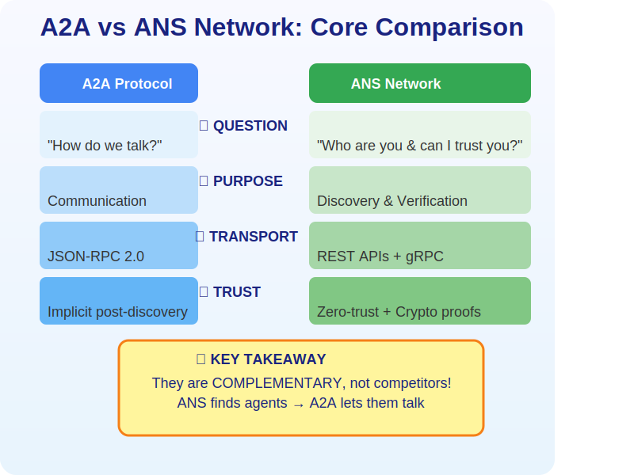
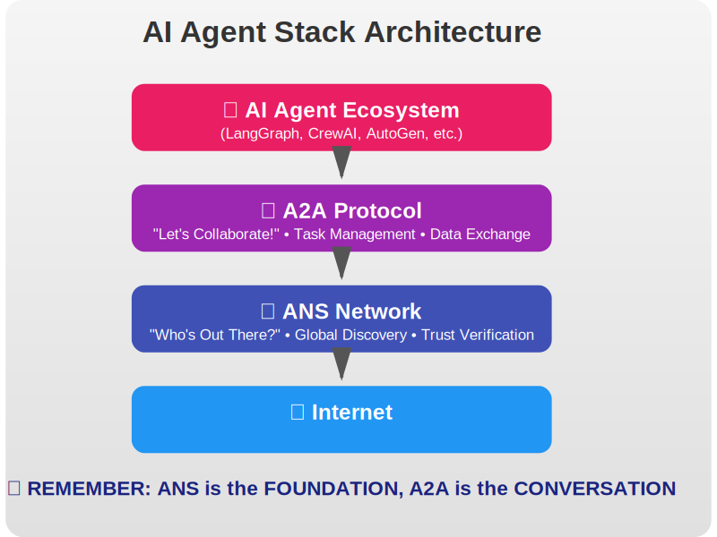
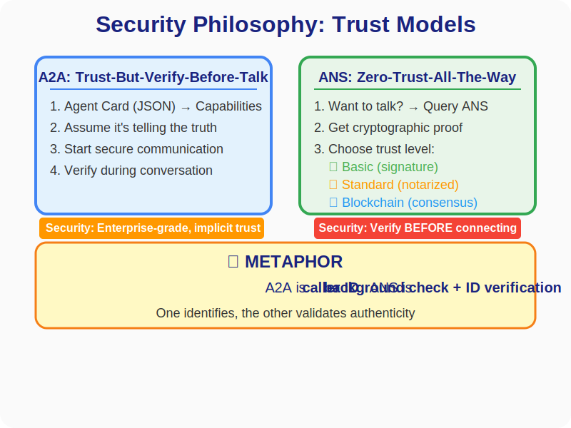
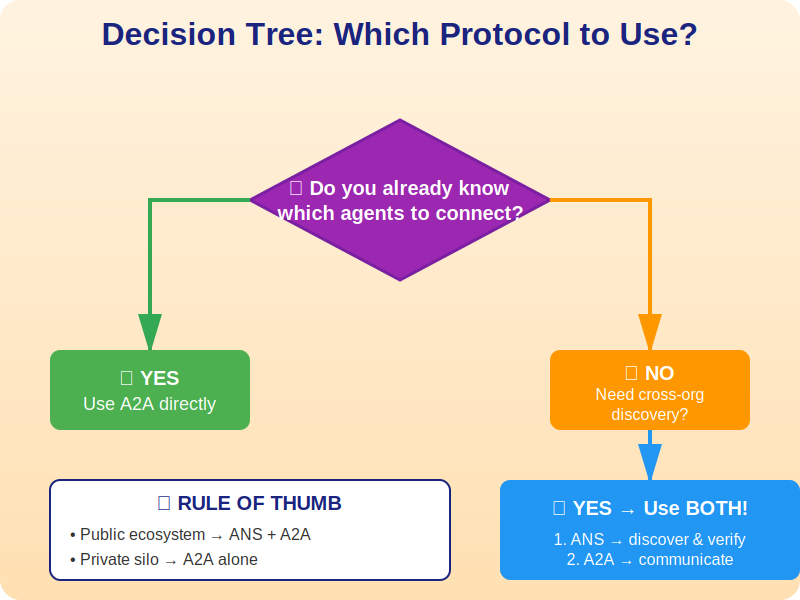
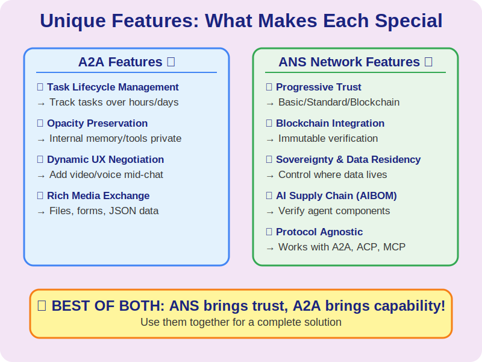
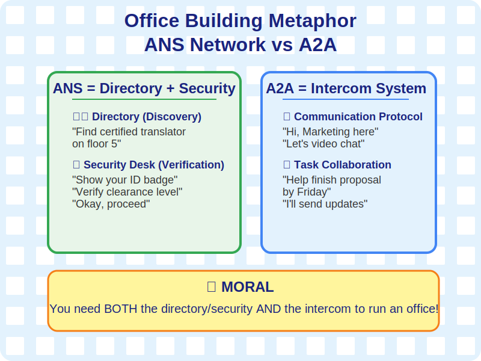
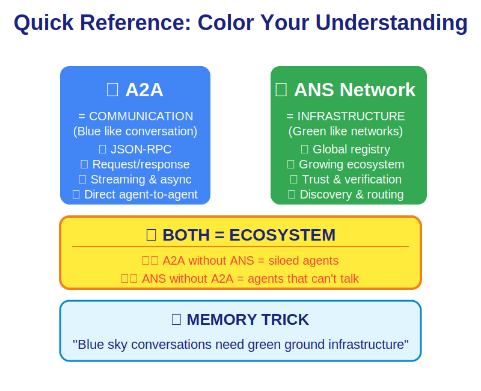
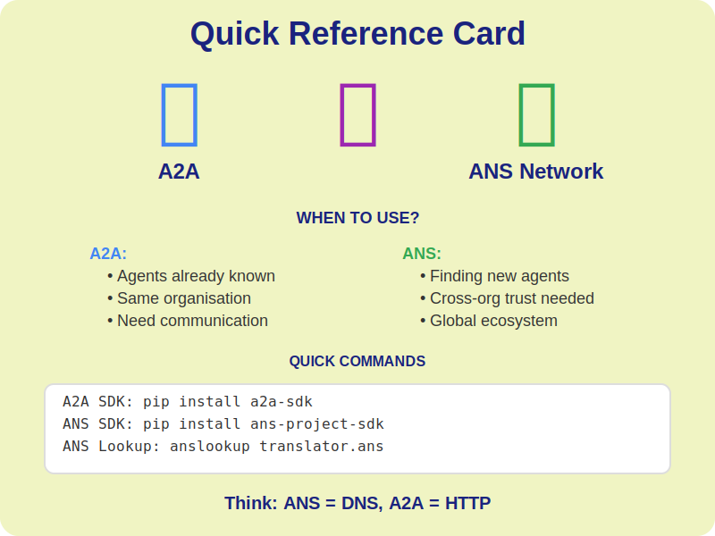
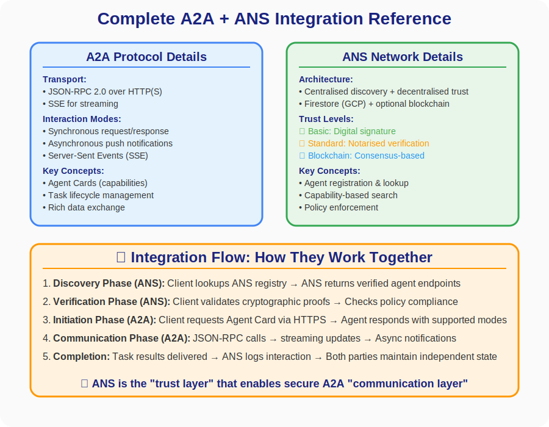

# ANS Visual Flashcards

A collection of visual guides to help you understand the Agent Network System (ANS) and the Agent-to-Agent (A2A) protocol.

## 1. Core Comparison

## 2. Architecture Stack

## 3. Trust Models

## 4. Decision Tree

## 5. Feature Comparison

## 6. Real-World Metaphor

## 7. Color-Coded Summary

## 8. Quick Reference Card

## 9. Integration Reference

