# Agent Network System (ANS): A Foundational Hybrid Architecture for Secure AI Agent Ecosystems

**Core Mechanisms for High Performance Discovery, Multi-Level Trust, and Confidential Verification**

**Version 0.1.0 – Request for Comment**  | **02 May 2025**

**gClouds R&D | gLabs**

## Executive Summary

ANS provides a unified framework for AI agents to discover, verify, and connect with each other. This is crucial as agents proliferate across organisations and domains. ANS uses both fast, centralised services (for quick lookups) and a decentralised blockchain layer (for trust and verification).

Just as DNS maps hostnames to addresses, ANS lets agents look up other agents’ identities and capabilities via human readable identifiers. This infrastructure enables a new ecosystem of interoperable AI agents that can collaborate across organisational boundaries while maintaining strong trust guarantees.

We detail the ANS architecture, operations, trust model, and key algorithms so that developers and contributors can build consistent, interoperable implementations.

## Glossary and Terminology

**A2A (Agent-to-Agent Protocol):** Google's protocol that defines standards for direct communication between AI agents, focusing on message exchange formats and interaction patterns.

**ABAC (Attribute-Based Access Control):** A security model that grants access based on attributes associated with users, resources, and environmental conditions.

**ACP (Agent Communication Protocol):** IBM Research's specification for standardizing agent communication, including delegation and orchestration mechanisms.

**AIBOM (AI Bill of Materials):** A structured format documenting an AI agent's components, similar to a Software Bill of Materials (SBOM) but specific to AI systems, including models, datasets, and training processes.

**ANS (Agent Network System):** The protocol and infrastructure described in this specification, enabling AI agents to discover, verify, and connect with each other.

**Blockchain Registry:** The decentralized ledger component of ANS that provides immutable records of agent registrations and verifications.

**CRDT (Conflict-Free Replicated Data Type):** Data structures that can be replicated across multiple computers in a network, edited concurrently, and automatically resolved.

**DID (Decentralized Identifier):** A W3C standard for verifiable, self-sovereign digital identities that don't require a centralized registration authority.

**DNS-SD (DNS-Based Service Discovery):** A protocol that uses DNS records to discover services available on a network.

**gRPC:** A high performance, open source remote procedure call (RPC) framework that can run in any environment.

**MCP (Model Context Protocol):** A protocol standard for AI models to access and utilize external tools and services.

**OpenAPI:** A specification for building, documenting, and consuming RESTful web services.

**SAML (Security Assertion Markup Language):** An open standard for exchanging authentication and authorization data between parties.

**SBOM (Software Bill of Materials):** A formal record containing the details and supply chain relationships of various components used in building software.

**OIDC (OpenID Connect):** An identity layer built on top of the OAuth 2.0 protocol for authentication.

**ZKP (Zero-Knowledge Proof):** A cryptographic method allowing one party to prove to another that a statement is true without revealing any additional information beyond the validity of the statement itself.

## 1. Introduction

### 1.1 The AI Agent Discovery Challenge

As AI agents become increasingly sophisticated and widespread, they need reliable mechanisms to find and verify each other. Consider these scenarios:

* A sales agent needs to locate procurement agents at partner organisations
* A consumer agent needs to verify the authenticity of a service provider's agent
* A developer creating a specialised agent needs to discover existing agents for potential integration

These examples show that agents must locate and trust each other across different organisations. A global discovery system is needed to make this scalable and reliable.

### 1.2 Limitations of Current Approaches and Emerging Protocols

While the vision of interconnected AI agents is compelling, current and emerging approaches to agent discovery and interaction face significant limitations when aiming for a global, interoperable, and trustworthy ecosystem:

**Emerging Communication Protocols Highlight the Discovery Gap:**

* **A2A (Google):** Google’s A2A protocol defines how agents communicate after discovery, but it does not include a discovery service. Without ANS, A2A-based systems would fall back on manual setup or proprietary directories, which do not scale and create silos.
* **MCP (a protocol for AI models to use external tools):** MCP standardises how AI models use external tools, but it lacks a global registry. As a result, tool discovery often stays within predefined sets or requires custom integrations, limiting flexibility.
* **IBM Research’s ACP (Agent Communication Protocol)** IBM Research's ACP, aiming to standardise broader agent communication including delegation and orchestration, also presupposes a method for agents to find and verify each other, especially across organisational boundaries. Without a universal discovery and verification layer like ANS, ACP implementations could face challenges in moving beyond platform specific directories or manual setups for establishing trusted interactions.

**Persistent General Limitations:**

* **Centralised Directories (Proprietary or Platform Specific):** Many existing solutions rely on centralised directories, which can become single points of failure, raise concerns about data control and trust in the directory provider, and often create walled gardens that hinder cross-ecosystem interoperability.
* **Manual Configuration:** Relying on developers to manually configure agent endpoints and trust relationships is not scalable for the dynamic and rapidly growing agent ecosystems envisioned. It's error-prone and slow.
* **Ad-hoc Integration:** Custom, one-off integrations between specific agents or platforms lead to fragmented silos, significantly limiting broader interoperability and the network effects of a connected agent economy.
* **Lack of Standardised, Robust Verification:** Most systems today have no common, secure way to verify an agent’s identity or capabilities. ANS introduces cryptographic and multi level verification to fill this gap.

These limitations underscore the critical need for a foundational infrastructure like the Agent Network System (ANS), designed to provide standardised, secure, and verifiable discovery across diverse agent platforms and protocols.

### 1.3 The ANS Model

The Agent Network System addresses these challenges through a hybrid architecture that provides:

* **Global Discovery**: A unified system for agent lookup by name or capability
* **Verifiable Trust**: Multi-level verification from basic to blockchain-based
* **High Performance**: Milliseconds-level  lookups at global scale
* **Open Standards**: Vendor-neutral protocols for broad ecosystem adoption
* **Resilient Design**: No single points of failure for critical infrastructure
* **Sovereignty Support**: Allows organisations to run regional instances so they control their agent data

## 2. Core Principles

ANS is based on the following design principles, which guide all implementations.

### 2.1 Hybrid Architecture

ANS combines centralised components for performance with decentralised systems for trust, creating an architecture that delivers the best of both worlds.

Implementations of ANS MUST adhere to this hybrid model, incorporating both high performance lookup capabilities and decentralised trust verification. This dual approach enables both the speed required for efficient agent discovery and the strong trust guarantees needed for secure operation.

For instance, an ANS deployment might use fast cloud servers for lookups, while recording trust attestations on a public blockchain.

### 2.2 Progressive Trust

ANS specifies a multi level approach to trust, allowing implementations to balance performance needs with security requirements for different use cases.

Implementations MUST support multiple verification levels, with progressively stronger security guarantees. This enables agents to:

1. Start with basic verification for non critical interactions
2. Progress to higher verification levels for more sensitive operations
3. Adopt blockchain based verification for mission critical applications

Basic = simple signatures (fast), Standard = checks by other authorities, Blockchain = consensus based proof (highest security).

### 2.3 Performance First

The ANS architecture prioritises high throughput, low latency operations for the most common use case: looking up agents by name or capability.

Compliant implementations SHOULD achieve milliseconds-level response times for cached lookups and optimise for the read heavy workload of agent discovery. Performance considerations MUST NOT compromise security for critical operations.

### 2.4 Zero-Trust Security

ANS embodies zero-trust principles, with no implicit trust between components or participants and continuous verification at all levels of the system.

Implementations MUST verify every request, regardless of source, and SHOULD implement defence in depth through multiple security layers. All verification claims MUST be cryptographically verifiable.

For example, even internal services in ANS must authenticate and authorise every request.

### 2.5 Global Distribution

ANS is designed for worldwide deployment with geographically distributed components to minimise latency for all users.

Implementations SHOULD support global distribution of both centralised and decentralised components, ensuring low-latency access from any region while respecting data sovereignty requirements.

### 2.6 Sovereignty Enablement

The ANS architecture MUST provide mechanisms that enable data sovereignty for participating entities. Implementations SHOULD support:

* Configuration of data residency boundaries
* Cryptographic controls for sensitive data
* Integration points with existing security infrastructure
* Clear delineation of control boundaries for agent data

These capabilities are essential to maintain organisational sovereignty while participating in the broader agent ecosystem.

### 2.7 Extensible Federation

ANS supports interconnection between multiple ANS implementations across organisational boundaries.

The specification MUST define clear federation protocols that enable distinct ANS deployments to share discovery information whilst respecting policy constraints. Implementations SHOULD support configurable federation policies.

This means e.g. two companies running separate ANS registries can choose to share certain agent data, subject to access policies.

## 3. System Architecture

The Agent Network System (ANS) is designed with a hybrid, three-layer architecture to balance performance, trust, and decentralization. Figure 1 provides a high-level overview of these layers and their primary components, showing how users and agents interact with the system primarily through the Registry Gateway, which then orchestrates operations across the different layers.

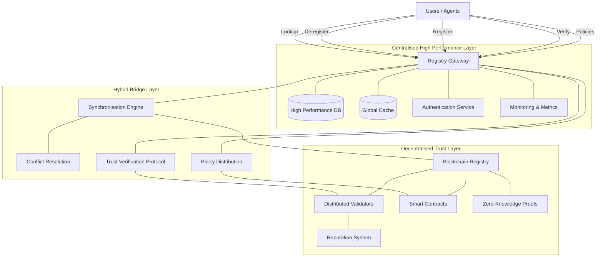

> Figure 1: ANS Three-Layer Architecture (Centralised, Bridge, Decentralised)

Figure 1 illustrates the three layer architecture: a Centralised High Performance Layer for fast queries, a Bridge Layer for synchronization/trust, and a Decentralised Trust Layer for blockchain services.

Users/agents interact with the Registry Gateway in the centralised layer, which communicates through the bridge layer to the blockchain based decentralised layer.

### 3.1 Centralised High Performance Layer

This layer MUST be optimised for speed and scalability, handling the highest volume of operations and serving as the primary interface for agent discovery.

#### 3.1.1 Registry Gateway

The Registry Gateway MUST:

* Serve as the entry point for all ANS operations
* Implement API endpoints for lookup, registration, verification, and policy management
* Provide rate limiting and abuse prevention
* Route requests to appropriate backend services based on operation type (lookup, register, etc.)
* Support regional routing for data sovereignty requirements

#### 3.1.2 High Performance Database

The High Performance Database component MUST:

* Store agent records with milliseconds access times
* Implement horizontal sharding for scalability to billions of records
* Support replication with regional controls for data residency
* Be optimised for read heavy workloads of agent lookups
* Support both global and regional deployment models

#### 3.1.3 Global Cache Layer

The Global Cache Layer MUST:

* Cache frequently accessed agent records for even faster retrieval
* Be distributed across global regions for minimal latency
* Implement intelligent invalidation strategies
* Reduce database load for popular queries
* Support regional restrictions for compliance

#### 3.1.4 Authentication Service

The Authentication Service MUST:

* Verify identity of agents and users accessing the system
* Issue time-limited access tokens
* Enforce granular access control policies
* Provide integration interfaces for identity providers (SAML, OIDC)
* Support role-based and attribute-based access control

#### 3.1.5 Monitoring & Metrics System

The Monitoring & Metrics System MUST:

* Provide real-time observability into system health
* Track performance metrics for operational management
* Enable automatic circuit breaking for degraded components
* Support alerting and proactive recovery
* Expose metrics dashboards for system operators
* Implement distributed tracing for end-to-end visibility of operations

### 3.2 Hybrid Bridge Layer

This middle layer MUST bridge the centralised and decentralised components, ensuring consistency, trust, and policy enforcement across the system.
This layer acts as a translator and synchroniser between the fast database and the blockchain, ensuring they do not drift.

#### 3.2.1 Synchronisation Engine

The Synchronisation Engine component MUST maintain consistency between high performance database and blockchain registry. It SHALL handle different update cadences and latency requirements.

Implementations MUST support granular consistency models with per-attribute configuration:

* Strong consistency MUST be used for identity and trust-critical claims
* Bounded consistency SHOULD be used for capability updates and metadata
* Eventual consistency MAY be used for non-critical attributes

The Synchronisation Engine MUST provide multiple synchronisation methods:

* Standard synchronisation for efficiency (batch operations)
* Priority synchronisation for expedited critical operations
* Emergency synchronisation for immediate security concerns

The Synchronisation Engine MUST:

* Ensure verified records in the database match blockchain state
* Implement Conflict-Free Replicated Data Types (CRDTs) for appropriate attribute types to minimise conflicts
* Handle backpressure with robust queuing mechanisms for blockchain congestion
* Periodically post Merkle roots of synced records to the blockchain for external verification
* Provide cryptographic proofs that centralised database accurately reflects blockchain state

The following algorithm defines the core synchronisation operation.
This algorithm ensures that any new or updated agent record in the database is correctly propagated to the blockchain (or vice versa) according to its priority.

```pseudocode
ALGORITHM SynchronizeRecord(record, priorityLevel)
  // Input: record to synchronize, priority level (standard, priority, emergency)
  // Output: synchronization result with status and proofs

  BEGIN
    // 1. Determine consistency requirements based on attribute types
    consistencyRequirements ← GetConsistencyRequirements(record)
  
    // 2. Validate record structure and signature
    IF NOT ValidateRecord(record) THEN
      RETURN SyncResult(FAILED, "Invalid record format or signature")
    END IF
  
    // 3. Apply local validation rules
    validationResult ← ValidateLocalRules(record)
    IF NOT validationResult.success THEN
      RETURN SyncResult(FAILED, validationResult.reason)
    END IF
  
    // 4. Check for conflicts with existing records
    conflicts ← DetectConflicts(record)
    IF conflicts.exists AND priorityLevel != EMERGENCY THEN
      // Pass to conflict resolution if not emergency
      resolution ← ConflictResolutionModule.Resolve(record, conflicts)
      IF resolution.action == ABORT THEN
        RETURN SyncResult(FAILED, resolution.reason)
      ELSIF resolution.action == MODIFY THEN
        record ← ApplyResolutionChanges(record, resolution.changes)
      END IF
    END IF
  
    // 5. Determine synchronization method based on priority
    syncMethod ← SelectSyncMethod(priorityLevel, consistencyRequirements)
  
    // 6. Apply local database update with appropriate isolation level
    dbResult ← UpdateLocalDatabase(record, consistencyRequirements.localIsolationLevel)
    IF NOT dbResult.success THEN
      RETURN SyncResult(FAILED, dbResult.reason)
    END IF
  
    // 7. Submit to blockchain based on synchronization method
    IF syncMethod == IMMEDIATE THEN
      blockchainResult ← SubmitToBlockchainImmediate(record)
      waitForConfirmation ← TRUE
    ELSIF syncMethod == PRIORITY THEN
      blockchainResult ← SubmitToBlockchainPriority(record)
      waitForConfirmation ← TRUE
    ELSE // STANDARD
      blockchainResult ← QueueForBlockchainSubmission(record)
      waitForConfirmation ← FALSE
    END IF
  
    // 8. For immediate/priority sync, wait for blockchain confirmation
    IF waitForConfirmation THEN
      confirmationResult ← WaitForBlockchainConfirmation(blockchainResult.txId, TIMEOUT)
      IF NOT confirmationResult.success THEN
        // Record partially synced state
        RecordPartialSync(record, dbResult, blockchainResult)
        RETURN SyncResult(PARTIAL, "Blockchain confirmation timeout", dbResult.proof)
      END IF
    END IF
  
    // 9. Generate cryptographic proof linking database state to blockchain
    IF waitForConfirmation THEN
      proof ← GenerateCryptographicProof(record, blockchainResult.txId)
    ELSE
      proof ← GenerateProvisionalProof(record, blockchainResult.queueId)
    END IF
  
    // 10. Return successful result with appropriate proofs
    RETURN SyncResult(SUCCESS, NULL, proof)
  END
```

#### 3.2.2 Conflict Resolution Module

The Conflict Resolution Module MUST implement hierarchical resolution strategies for state conflicts with clear scope of authority:

* **Trust claims**: Blockchain state is authoritative (revocation on blockchain always overrides availability in HP DB)
* **Availability status**: HP DB state is authoritative for temporarily unavailable agents only
* **Capability updates**: Time-based resolution with configurable thresholds for automatic vs. manual review

Implementations MUST:

* Provide audit trails for all conflict resolutions
* Support customisable rules for specific deployment needs
* Automatically escalate critical conflicts to system operators
* Implement risk scoring to trigger mandatory manual review

The following algorithm defines the conflict resolution process:

```pseudocode
ALGORITHM ResolveConflict(newRecord, existingRecord)
  // Resolves conflicts between a new record and existing record
  // Returns resolution action and changes if any
  BEGIN
    // Initialize resolution result
    resolution ← {
      "action": "PROCEED", // Default action
      "reason": "",
      "changes": [],
      "audit_trail": {
        "timestamp": CurrentTimestamp(),
        "conflict_type": "",
        "resolution_rule_applied": "",
        "confidence": 1.0
      }
    }
  
    // 1. Check for trust claim conflicts (highest priority)
    trustClaimConflicts ← DetectTrustClaimConflicts(newRecord, existingRecord)
    IF trustClaimConflicts.exists THEN
      // For trust claims, blockchain state is always authoritative
      IF existingRecord.source == "BLOCKCHAIN" AND existingRecord.status == "REVOKED" THEN
        resolution.action ← "ABORT"
        resolution.reason ← "Blockchain shows trust revocation"
        resolution.audit_trail.conflict_type ← "TRUST_CLAIM"
        resolution.audit_trail.resolution_rule_applied ← "BLOCKCHAIN_AUTHORITATIVE"
        resolution.audit_trail.confidence ← 1.0
    
        // Log critical trust conflict
        LogCriticalConflict("TRUST_REVOCATION_OVERRIDE_ATTEMPT", newRecord, existingRecord)
    
        RETURN resolution
      END IF
    END IF
  
    // 2. Check for availability status conflicts (second priority)
    availabilityConflicts ← DetectAvailabilityConflicts(newRecord, existingRecord)
    IF availabilityConflicts.exists THEN
      // For temporary availability, HP DB state is authoritative
      IF newRecord.source == "HPDB" AND 
         newRecord.availability_status == "TEMPORARILY_UNAVAILABLE" AND
         existingRecord.availability_status == "AVAILABLE" THEN
     
        resolution.action ← "PROCEED"
        resolution.audit_trail.conflict_type ← "AVAILABILITY_STATUS"
        resolution.audit_trail.resolution_rule_applied ← "HPDB_AUTHORITATIVE_FOR_TEMPORARY"
        resolution.audit_trail.confidence ← 0.9
    
        RETURN resolution
      END IF
    END IF
  
    // 3. Check for capability update conflicts (third priority)
    capabilityConflicts ← DetectCapabilityConflicts(newRecord, existingRecord)
    IF capabilityConflicts.exists THEN
      // Apply time-based resolution for capability updates
      timeDelta ← TimeElapsedBetween(existingRecord.timestamp, newRecord.timestamp)
  
      IF timeDelta < CAPABILITY_AUTO_RESOLVE_THRESHOLD THEN
        // Recent update, choose newer by default
        IF newRecord.timestamp > existingRecord.timestamp THEN
          resolution.action ← "PROCEED"
        ELSE
          resolution.action ← "ABORT"
          resolution.reason ← "Newer capability definition already exists"
        END IF
    
        resolution.audit_trail.conflict_type ← "CAPABILITY_UPDATE"
        resolution.audit_trail.resolution_rule_applied ← "TIME_BASED_AUTO_RESOLUTION"
        resolution.audit_trail.confidence ← 0.8
      ELSE
        // Significant time difference requires manual review for high-risk operations
        riskScore ← CalculateRiskScore(newRecord, existingRecord, capabilityConflicts)
    
        IF riskScore > MANUAL_REVIEW_THRESHOLD THEN
          resolution.action ← "ESCALATE"
          resolution.reason ← "High-risk capability changes require manual review"
          resolution.audit_trail.conflict_type ← "CAPABILITY_UPDATE"
          resolution.audit_trail.resolution_rule_applied ← "RISK_BASED_ESCALATION"
          resolution.audit_trail.confidence ← 0.5
      
          // Trigger manual review workflow
          TriggerManualReview(newRecord, existingRecord, capabilityConflicts, riskScore)
        ELSE
          resolution.action ← "PROCEED"
          resolution.audit_trail.conflict_type ← "CAPABILITY_UPDATE"
          resolution.audit_trail.resolution_rule_applied ← "RISK_BASED_AUTO_RESOLUTION"
          resolution.audit_trail.confidence ← 0.7
        END IF
      END IF
  
      RETURN resolution
    END IF
  
    // 4. Default case: no critical conflicts
    resolution.action ← "PROCEED"
    RETURN resolution
  END
```

In essence, if the blockchain says an agent is revoked, that decision wins (algorithm aborts). Otherwise, availability issues defer to the database state, and capability changes are resolved by timestamps or manual review.

#### 3.2.3 Trust Verification Protocol

The Trust Verification Protocol MUST:

* Implement multi-level verification mechanisms
* Coordinate with distributed validators for trust establishment
* Provide cryptographic proofs of verification
* Support different verification strength based on use case needs
* Enable dynamic trust negotiation for agent-to-agent communication
* Verify selective disclosure proofs for privacy-preserving verification
* Implement decentralised trust source prioritisation with validator reputation weighting
* Issue short-lived, context-specific attestations to reduce verification overhead

The following algorithm defines the validator consensus verification process:

```pseudocode
ALGORITHM VerifyWithValidators(agentId, claimsToVerify, requiredConsensus)
  // Verify agent claims through distributed validator network
  // requiredConsensus: minimum number of validators required to agree (0.0-1.0)
  BEGIN
    // 1. Prepare verification request
    verificationRequest ← {
      "agent_id": agentId,
      "claims_to_verify": claimsToVerify,
      "request_id": GenerateUUID(),
      "timestamp": CurrentTimestamp(),
      "requester": GetServiceIdentity()
    }
  
    // 2. Sign the verification request
    signedRequest ← SignMessage(verificationRequest, SERVICE_PRIVATE_KEY)
  
    // 3. Select validators based on reputation and availability
    eligibleValidators ← SelectEligibleValidators(MIN_REPUTATION_THRESHOLD, MIN_REQUIRED_VALIDATORS)
  
    // 4. Submit verification request to validators
    validatorResponses ← []
    responsePromises ← []
  
    FOR EACH validator IN eligibleValidators DO
      promise ← AsyncSubmitVerificationRequest(validator, signedRequest)
      responsePromises.append(promise)
    END FOR
  
    // 5. Wait for sufficient responses (with timeout)
    validatorResponses ← WaitForResponses(responsePromises, VERIFICATION_TIMEOUT)
  
    // 6. Calculate consensus
    validResponses ← FilterValidResponses(validatorResponses)
  
    IF validResponses.length < MIN_REQUIRED_VALIDATORS THEN
      RETURN {
        "verified": false,
        "reason": "Insufficient validator responses",
        "validator_count": validResponses.length,
        "minimum_required": MIN_REQUIRED_VALIDATORS
      }
    END IF
  
    // 7. Process verification results by claim
    claimResults ← {}
  
    FOR EACH claim IN claimsToVerify DO
      // Count validators confirming this claim
      validatorsConfirming ← CountValidatorsConfirming(validResponses, claim)
      consensusLevel ← validatorsConfirming / validResponses.length
  
      // Calculate weighted consensus based on validator reputation
      weightedConsensus ← CalculateWeightedConsensus(validResponses, claim)
  
      claimResults[claim] ← {
        "verified": weightedConsensus >= requiredConsensus,
        "consensus_level": consensusLevel,
        "weighted_consensus": weightedConsensus,
        "validator_count": validatorsConfirming,
        "attestations": ExtractAttestations(validResponses, claim)
      }
    END FOR
  
    // 8. Determine overall verification result
    allClaimsVerified ← true
  
    FOR EACH claim, result IN claimResults DO
      IF NOT result.verified THEN
        allClaimsVerified ← false
        BREAK
      END IF
    END FOR
  
    // 9. Return the verification result
    RETURN {
      "verified": allClaimsVerified,
      "claim_results": claimResults,
      "validator_responses": validResponses.length,
      "timestamp": CurrentTimestamp()
    }
  END
```

#### 3.2.4 Policy Distribution Module

The Policy Distribution Module MUST:

* Allow registration and distribution of agent interaction policies
* Implement policy evaluation during verification operations
* Support standardised policy language for machine-readable controls
* Provide policy conflict detection and resolution
* Enable granular access control for sensitive operations
* Support policy versioning with rollback capabilities
* Offer policy simulation/dry-run mode for impact analysis
* Generate compliance reporting for policy adherence

Policies are stored in the central database and referenced during verification (with hashes logged on-chain), ensuring that every agent-to-agent interaction checks against the right rules.

### 3.3 Decentralised Trust Layer

This layer MUST provide strong trust guarantees through blockchain technology and distributed validation. This includes: Blockchain Registry, Distributed Validators, Smart Contracts, Validator Reputation, and Zero-Knowledge Proofs.

#### 3.3.1 Blockchain Registry

The Blockchain Registry MUST:

* Store immutable records of agent registrations and claims
* Provide tamper-proof verification history
* Enable third-party verification of agent identities
* Support multiple blockchain options (public, permissioned) **Status**: not yet implemented
* Implement cost-efficient transaction batching for high-volume operations
* Utilise L2 scaling solutions (state channels, rollups) for frequent updates
* Maintain full auditability of all trust-critical operations

#### 3.3.2 Distributed Validators

The Distributed Validators (e.g. a node run by an organisation) component MUST:

* Provide a network of nodes that validate agent claims
* Be geographically and organisationally diverse for trust
* Reach consensus on verification of critical agent attributes
* Provide cryptographic attestations of validation
* Support managed validator deployment options
* Participate in reputation system to incentivise honest behaviour
* Be subject to slashing conditions for malicious behaviour
* Support integration with specific validation oracles
* Provide transparent evidence for validator slashing decisions

#### 3.3.3 Smart Contracts

The Smart Contracts component MUST:

* Encode verification rules and governance in blockchain code
* Manage verification states and proofs
* Automate validation processes
* Implement incentive mechanisms for validators
* Support extensible verification mechanisms
* Enforce slashing conditions for validator misbehaviour
* Provide transparent governance for system parameters
* Record publicly auditable evidence for validator slashing

#### 3.3.4 Validator Reputation System

**Status**: Under Development

The Validator Reputation System MUST:

* Track validator performance and reliability over time
* Affect validator influence in consensus decisions
* Consider factors like uptime, accuracy, and response time
* Provide economic incentives for maintaining high reputation
* Enable network participants to select validators based on reputation
* Detect and penalise collusion attempts

This ensures that validators with a history of accurate attestations have more influence in consensus decisions.

#### 3.3.5 Zero-Knowledge Proof System

**Status**: Under Development

The Zero-Knowledge Proof System MUST:

* Enable privacy-preserving verification of agent attributes
* Allow selective disclosure of capabilities without revealing sensitive details
* Support verification of compliance without exposing implementation details
* Provide cryptographic commitments to private attributes
* Integrate with verification protocol for seamless privacy controls
* Issue short lived attestations for specific interaction contexts

For example, an agent could prove it has a certified capability level without revealing the underlying data.

### 3.4 Standards Alignment and Interoperability

ANS is designed to integrate with existing standards and protocols to maximise compatibility and adoption:

#### 3.4.1 DID (Decentralised Identifier) Integration

ANS agent identifiers SHOULD be mappable to DID specifications:

```json
{
  "agent_id": "my-agent.example.ans",
  "did": {
    "id": "did:ans:abc123xyz456",
    "controller": "did:web:example.com",
    "verification_method": [
      {
        "id": "did:ans:abc123xyz456#key-1",
        "type": "Ed25519VerificationKey2020",
        "controller": "did:web:example.com",
        "public_key_multibase": "z6MkhaXgBZDvotDkL5257faiztiGiC2QtKLGpbnnE_example"
      }
    ]
  }
}
```

> Example: An ANS agent record with a corresponding Decentralized Identifier (DID)

#### 3.4.2 DNS-SD Integration

For service discovery via DNS:

```pseudocode
_ans._tcp.<domain> IN SRV 0 0 <port> <hostname>
_ans._tcp.<domain> IN TXT "agentId=<agent_id>" "capabilities=<cap1,cap2>"
```

This shows how an agent could publish its ANS service via DNS Service Discovery, using a standard SRV record and TXT metadata (with an ANS-specific prefix).

#### 3.4.3 gRPC Service Discovery

For programmatic service discovery:

```protobuf
syntax = "proto3";
package ans.discovery;

service ANSDiscovery {
  rpc Lookup(LookupRequest) returns (LookupResponse) {}
  rpc Register(RegisterRequest) returns (RegisterResponse) {}
  rpc Verify(VerifyRequest) returns (VerifyResponse) {}
}

message LookupRequest {
  string query = 1;
  repeated string capabilities = 2;
  string trust_level = 3;
  PolicyRequirements policy_requirements = 4;
}
// Additional message definitions omitted for brevity
```

#### 3.4.4 OpenAPI Specification

ANS SHOULD expose a standardised API described in OpenAPI:

```yaml
openapi: 3.0.0
info:
  title: Agent Network System API
  version: 1.0.0
paths:
  /lookup:
    post:
      summary: Look up agents by name, capability, or other attributes
      requestBody:
        content:
          application/json:
            schema:
              $ref: '#/components/schemas/LookupRequest'
      responses:
        '200':
          description: Successful lookup
          content:
            application/json:
              schema:
                $ref: '#/components/schemas/LookupResponse'

components:
  schemas:
    LookupRequest:
      type: object
      properties:
        query:
          type: string
          description: Name or capability to search for
        capabilities:
          type: array
          items:
            type: string
          description: List of required capabilities
        trust_level:
          type: string
          enum: [basic, standard, blockchain]
          description: Minimum trust level required
```

## 4. Core Operations

The ANS system exposes five primary operations (e.g., lookup, register, deregister, verify, policy management).

### 4.1 Lookup

The most common operation, used to discover agents by name, capability, or other attributes.
When an agent calls Lookup, the request goes through the Registry Gateway, which checks cache and then DB, returning agent details.

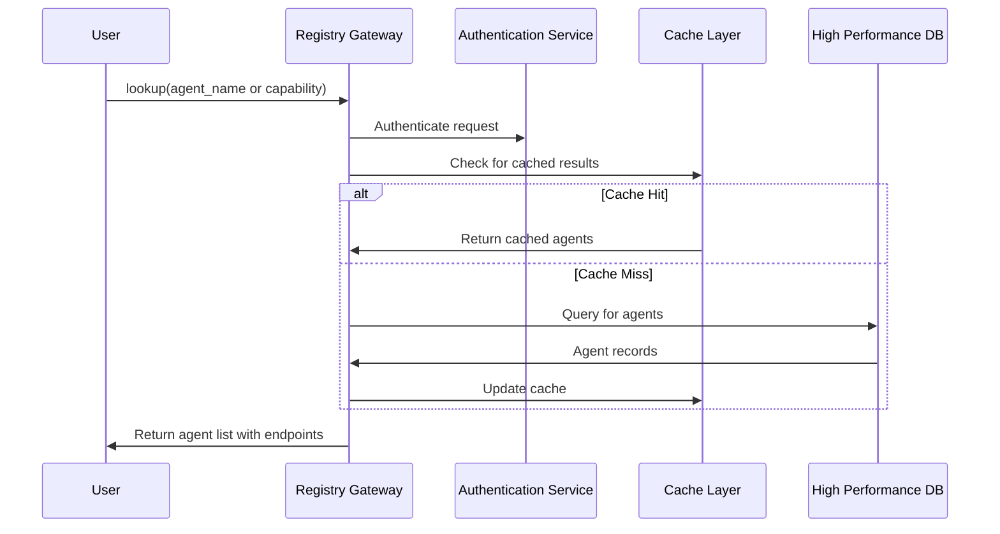

> Figure 2: Lookup Operation Sequence Diagram

Figure 2 illustrates the flow of an agent lookup request initiated by a user/agent to the Registry Gateway, which then interacts with the Authentication Service, Cache Layer, and High Performance Database to retrieve and return agent details.

#### 4.1.1 Lookup API

```json
// Request
{
  "method": "lookup",
  "params": {
    "query": "sales-assistant",
    "capabilities": ["customer_support", "product_recommendation"],
    "trust_level": "verified",
    "limit": 10,
    "policy_requirements": {
      "verification_level": "standard",
      "capabilities": ["secure_messaging"]
    }
  }
}

// Response
{
  "status": "success",
  "results": [
    {
      "agent_id": "nia.example.ans",
      "name": "Nia Sales Assistant",
      "description": "AI sales assistant for Example Corp",
      "organization": "Example Corp",
      "endpoints": {
        "a2a": "https://nia-sales.example.com/a2a",
        "mcp": "https://nia-sales.example.com/mcp"
      },
      "capabilities": ["sales_support", "product_recommendation"],
      "verification": {
        "level": "verified",
        "timestamp": "2025-05-17T14:22:31Z",
        "blockchain_proof": {
          "transaction_id": "0x8a7d53b7cc7e9c2f11d0306e6c67896512aa7e81a6cf82f5db74c82fb1e0c161",
          "block_number": 15783922
        }
      },
      "policy_compatibility": true // agent meets the policy requirements
    },
    // Additional results...
  ],
  "total_matches": 24,
  "next_page_token": "eyJwYWdlIjogMiwgImxpbWl0IjogMTB9"
}
```

### 4.2 Register

Used to publish an agent's existence, capabilities, and endpoints to the ANS system.
Registering an agent with ANS involves several steps to ensure data integrity and appropriate verification. The workflow, detailed in Figure 3, begins with a request to the Registry Gateway and proceeds through provisional recording and a comprehensive verification process that may involve the blockchain layer.

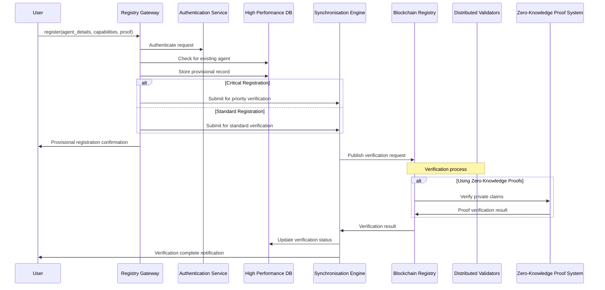

> Figure 3: Registration Operation Sequence Diagram
>
> Depicts the process of an agent registering with ANS, from the initial request to the Registry Gateway, provisional storage in the High Performance DB, and subsequent verification steps involving the Synchronisation Engine, Blockchain Registry, and potentially the Zero-Knowledge Proof System. Full registration is contingent upon successful verification.

> [!Note]
> Full registration isn’t complete until validators confirm.

#### 4.2.1 Registration API

```json
// Request
{
  "method": "register",
  "params": {
    "agent_id": "my-agent.example.ans",
    "name": "My Agent",
    "description": "Specialised support agent",
    "organization": "Example Corp",
    "capabilities": ["document_processing", "customer_support"],
    "endpoints": {
      "a2a": "https://my-agent.example.com/a2a",
      "rest": "https://my-agent.example.com/api/v1",
      "policy_negotiation": "https://my-agent.example.com/policy/negotiate"
    },
    "verification_level": "blockchain",
    "public_key": "-----BEGIN PUBLIC KEY-----\nMIIBIjANBgkqhkiG9w0B...\n-----END PUBLIC KEY-----",
    "data_residency": ["us", "eu"],
    "critical_registration": true,
    "private_claims": {
      "capability_proofs": {
        "financial_transactions_level_3": "<ZKP commitment>",
        "regulatory_compliance": "<ZKP commitment>"
      }
    },
    "supply_chain": {
      "aibom_url": "https://sbom.example.com/agent-components.json",
      "aibom_hash": "sha256:a1b2c3d4e5f6...",
      "verification_attestations": [
        {
          "type": "iso27001", 
          "issuer": "CertCo Inc",
          "certificate_id": "ISO27001-2024-1234",
          "validity_url": "https://certco.com/verify/ISO27001-2024-1234",
          "valid_until": "2026-05-18T00:00:00Z"
        },
        {
          "type": "nist_aiml_framework",
          "issuer": "AISecure Labs",
          "report_id": "NIST-AIML-5678",
          "validity_url": "https://aisecurelabs.com/verify/NIST-AIML-5678"
        }
      ]
    }
  }
}

// Response
{
  "status": "success",
  "registration": {
    "agent_id": "my-agent.example.ans",
    "provisional_status": "registered",
    "verification_pending": true,
    "verification_id": "ver_78a92bcd",
    "estimated_verification_time": "30s",
    "data_residency_confirmed": ["us", "eu"],
    "private_claims": {
      "commitments_recorded": 2
    },
    "attestation_verification": {
      "status": "in_progress",
      "verification_id": "att_ver_912ecdf"
    }
  }
}
```

### 4.3 Deregister

Agents can be removed from the registry, or have specific capabilities revoked, through the deregister operation. Figure 4 outlines this process, which ensures that changes are reflected in both the centralized and decentralized layers of ANS.

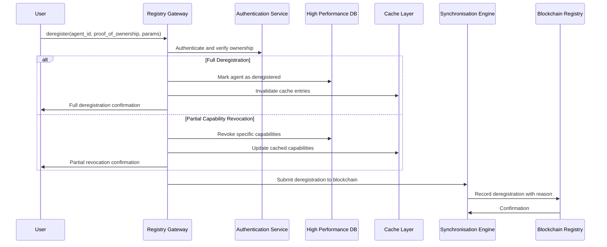

> Figure 4: Deregistration Operation Sequence Diagram.
>
> Shows the steps for removing an agent or revoking its capabilities. The process is initiated at the Registry Gateway, involves updates to the High-Performance DB and cache, and is finalized by the Synchronisation Engine recording the deregistration on the Blockchain Registry.

#### 4.3.1 Deregistration API

```json
// Request
{
  "method": "deregister",
  "params": {
    "agent_id": "my-agent.example.ans",
    "proof_of_ownership": {
      "signature": "a9b8c7d6e5f4...",
      "timestamp": "2025-05-18T10:45:12Z"
    },
    "emergency": false,
    "reason_code": "planned_retirement",
    "revocation_type": "full", // or "partial"
    "capabilities_to_revoke": ["financial_transaction"], // only if type is "partial"
    "event_id": "evt_deregister_1a2b3c4d" // for correlation with systems
  }
}

// Response
{
  "status": "success",
  "deregistration": {
    "agent_id": "my-agent.example.ans",
    "status": "deregistered",
    "timestamp": "2025-05-18T10:45:15Z",
    "revocation_type": "full",
    "reason_code": "planned_retirement",
    "blockchain_confirmation_pending": true,
    "event_id": "evt_deregister_1a2b3c4d"
  }
}
```

### 4.4 Verify

Confirming an agent's authenticity and capabilities is achieved through the verify operation. As depicted in Figure 5, a verification request is made to the Registry Gateway, which then orchestrates the verification through the Trust Verification Protocol, engaging different system components based on the depth of verification required.

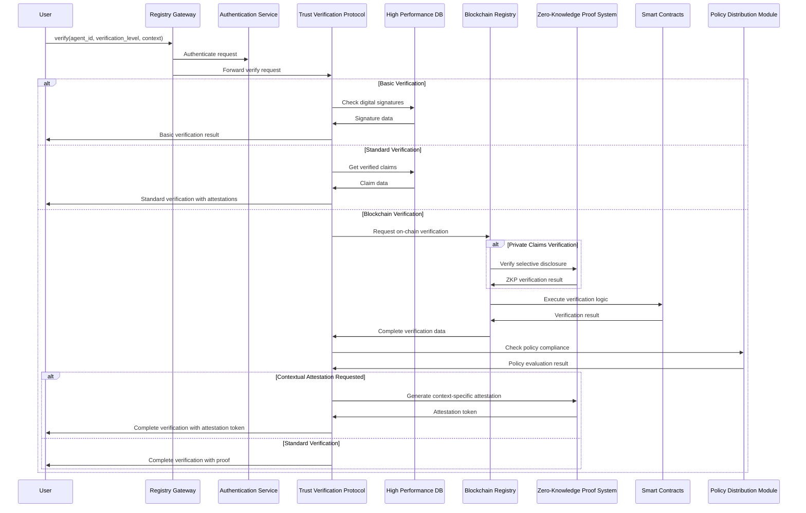

> Figure 5: Verification Operation Sequence Diagram.
>
> Illustrates the agent verification process initiated by a user/agent via the Registry Gateway. The Registry Gateway routes the request to the Trust Verification Protocol, which then coordinates with components like the High Performance DB, Blockchain Registry, Zero-Knowledge Proof System, and Policy Distribution Module depending on the required verification level and context.

#### 4.4.1 Verification API

```json
// Request
{
  "method": "verify",
  "params": {
    "agent_id": "nia.example.ans",
    "verification_level": "blockchain",
    "required_claims": ["identity", "organization", "capabilities"],
    "interaction_context": "financial_transaction",
    "requesting_agent": {
      "id": "my-agent.example.ans",
      "proof": "<signature_of_request>"
    },
    "private_claim_requests": [
      "financial_transactions_level_3"
    ],
    "verify_capabilities": ["payment_processing"],
    "contextual_attestation": {
      "requested": true,
      "valid_duration": "15m",
      "use_context": "payment_session_12345"
    },
    "event_id": "evt_verify_9z8y7x6w"
  }
}

// Response
{
  "status": "success",
  "verification_result": {
    "agent_id": "nia.example.ans",
    "verified": true,
    "verification_level": "blockchain",
    "claims_verified": [
      "identity",
      "organization",
      "capabilities",
      "endpoints"
    ],
    "capability_verification": {
      "payment_processing": {
        "verified": true,
        "attestation_sources": ["trusted_validator_1", "trusted_validator_3"]
      }
    },
    "private_claims": {
      "financial_transactions_level_3": {
        "verified": true,
        "proof": "<ZKP_verification>"
      }
    },
    "policy_compliance": {
      "compliant": true,
      "policy_id": "pol_fin_transactions_v2"
    },
    "blockchain_proof": {
      "transaction_id": "0x8a7d53b7cc7e9c2f11d0306e6c67896512aa7e81a6cf82f5db74c82fb1e0c161",
      "block_number": 15783922,
      "timestamp": "2025-05-17T14:22:31Z"
    },
    "contextual_attestation": {
      "token": "eyJhbGciOiJFUzI1NiIsInR5cCI6IkpXVCJ9...",
      "valid_until": "2025-05-18T11:30:00Z",
      "scope": "payment_session_12345"
    },
    "valid_until": "2025-08-17T14:22:31Z",
    "event_id": "evt_verify_9z8y7x6w"
  }
}
```

### 4.5 Policy Management

ANS allows agents to publish and manage interaction policies. Figure 6 illustrates the sequence for setting a policy, starting with a request to the Registry Gateway and ensuring the policy is stored and its commitment recorded on the blockchain.

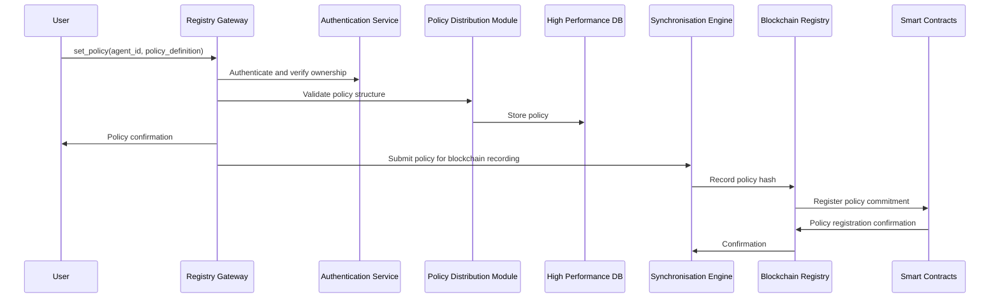

> Figure 6: Policy Management Operation Sequence Diagram
>
> Details the process for publishing or updating an agent's interaction policies. A user/agent submits the policy via the Registry Gateway, which then involves the Authentication Service, Policy Distribution Module, High Performance DB, and the Synchronisation Engine to record the policy hash on the Blockchain Registry.

#### 4.5.1 Policy Management API

```json
// Request
{
  "method": "set_policy",
  "params": {
    "agent_id": "my-agent.example.ans",
    "proof_of_ownership": {
      "signature": "a9b8c7d6e5f4...",
      "timestamp": "2025-05-18T10:45:12Z"
    },
    "policy": {
      "id": "pol_interaction_v1",
      "version": 1,
      "description": "Interaction policy for financial transactions",
      "required_verification_level": "blockchain",
      "required_capabilities": ["secure_messaging"],
      "allowed_interaction_types": ["a2a_session", "verified_query"],
      "allowed_organizations": ["trusted-partner.com", "*.verified-financial.org"],
      "required_attestations": ["financial_transactions_level_2"],
      "data_handling": {
        "data_residency": ["us", "eu"],
        "retention_period": "30d",
        "purpose_limitation": ["transaction_processing"]
      },
      "dynamic_negotiation": {
        "enabled": true,
        "negotiable_parameters": ["retention_period", "purpose_limitation"],
        "non_negotiable_parameters": ["required_verification_level", "required_attestations"]
      }
    },
    "event_id": "evt_policy_2b3c4d5e"
  }
}

// Response
{
  "status": "success",
  "policy_result": {
    "agent_id": "my-agent.example.ans",
    "policy_id": "pol_interaction_v1",
    "policy_version": 1,
    "policy_hash": "sha256:f1e2d3c4b5a6...",
    "status": "active",
    "timestamp": "2025-05-18T10:46:22Z",
    "blockchain_confirmation_pending": true,
    "event_id": "evt_policy_2b3c4d5e"
  }
}
```

## 5. Trust and Verification Mechanisms

### 5.1 Multi-Level Verification

The ANS system MUST support multiple verification levels to accommodate different trust requirements:

| Verification Level | Mechanism                                     | Use Case                     | Performance      | Trust Guarantee |
| ------------------ | --------------------------------------------- | ---------------------------- | ---------------- | --------------- |
| Basic              | Digital signature validation                  | Non-critical agent discovery | High (ms)        | Limited         |
| Standard           | Enhanced checks with third-party verification | Typical integration          | Medium (100s ms) | Moderate        |
| Blockchain         | Full blockchain consensus verification        | Mission-critical operations  | Low (seconds)    | Highest         |

The following algorithm defines the progressive trust implementation, formalising the transition between trust levels:
Agents start at their current verification level and can step up through Basic → Standard → Blockchain checks until the target level is reached.

```pseudocode
ALGORITHM VerifyAgentWithProgressiveTrust(agentId, targetLevel, requiredClaims)
  // Verifies an agent progressing through trust levels as needed
  // targetLevel: "basic", "standard", or "blockchain"
  BEGIN
    agent ← GetAgentRecord(agentId)
  
    IF agent == null THEN
      RETURN {
        "verified": false,
        "reason": "Agent not found",
        "level_achieved": "none"
      }
    END IF
  
    // Start with current verification level
    currentLevel ← agent.verification_level || "none"
    verification ← {
      "verified": false,
      "level_achieved": currentLevel,
      "claims_verified": [],
      "proofs": {}
    }
  
    // If already at or above target level, validate it's still valid
    IF TrustLevelRank(currentLevel) >= TrustLevelRank(targetLevel) THEN
      verificationResult ← ValidateExistingTrustLevel(agent, currentLevel, requiredClaims)
  
      IF verificationResult.verified THEN
        verification.verified ← true
        verification.claims_verified ← verificationResult.claims_verified
        verification.proofs ← verificationResult.proofs
        RETURN verification
      ELSE
        // Existing level invalid, attempt to rebuild from lower level
        currentLevel ← "none"
      END IF
    END IF
  
    // Step 1: Achieve Basic verification if needed
    IF TrustLevelRank(currentLevel) < TrustLevelRank("basic") AND
       TrustLevelRank(targetLevel) >= TrustLevelRank("basic") THEN
   
      basicResult ← VerifyBasicLevel(agent, requiredClaims)
  
      IF NOT basicResult.verified THEN
        verification.reason ← basicResult.reason
        RETURN verification
      END IF
  
      currentLevel ← "basic"
      verification.level_achieved ← "basic"
      verification.claims_verified ← basicResult.claims_verified
      verification.proofs.basic ← basicResult.proofs
  
      // If target was basic, we're done
      IF targetLevel == "basic" THEN
        verification.verified ← true
        RETURN verification
      END IF
    END IF
  
    // Step 2: Achieve Standard verification if needed
    IF TrustLevelRank(currentLevel) < TrustLevelRank("standard") AND
       TrustLevelRank(targetLevel) >= TrustLevelRank("standard") THEN
   
      standardResult ← VerifyStandardLevel(agent, requiredClaims)
  
      IF NOT standardResult.verified THEN
        // Still maintain basic verification
        verification.reason ← standardResult.reason
        RETURN verification
      END IF
  
      currentLevel ← "standard"
      verification.level_achieved ← "standard"
      verification.claims_verified ← [...verification.claims_verified, ...standardResult.claims_verified]
      verification.proofs.standard ← standardResult.proofs
  
      // If target was standard, we're done
      IF targetLevel == "standard" THEN
        verification.verified ← true
        RETURN verification
      END IF
    END IF
  
    // Step 3: Achieve Blockchain verification if needed
    IF TrustLevelRank(currentLevel) < TrustLevelRank("blockchain") AND
       TrustLevelRank(targetLevel) >= TrustLevelRank("blockchain") THEN
   
      blockchainResult ← VerifyBlockchainLevel(agent, requiredClaims)
  
      IF NOT blockchainResult.verified THEN
        // Still maintain previous verification level
        verification.reason ← blockchainResult.reason
        RETURN verification
      END IF
  
      currentLevel ← "blockchain"
      verification.level_achieved ← "blockchain"
      verification.claims_verified ← [...verification.claims_verified, ...blockchainResult.claims_verified]
      verification.proofs.blockchain ← blockchainResult.proofs
  
      verification.verified ← true
    END IF
  
    // Update agent record with new verification status
    UpdateAgentVerificationStatus(agent.id, verification)
  
    RETURN verification
  END
```

### 5.2 Trust Establishment Process

The ANS model specifies a comprehensive trust establishment process including:

* **Identity Verification**: Confirm ownership of agent domain or identifier
* **Capability Verification**: Validate claimed capabilities through testing
* **Endpoint Verification**: Ensure advertised endpoints are legitimate
* **Organisational Verification**: Link to verified organisation identity
* **Distributed Consensus**: Achieve validator agreement on verification
* **Supply Chain Validation**: Verify AI and software components (AIBOM/SBOM)
* **Development Practices Attestation**: Validate secure development lifecycle adherence
* **Private Claim Verification**: Verify sensitive claims using zero-knowledge proofs
* **Attestation Verification**: Validate industry certifications and external audits against registries

These steps MUST be implemented through formalised processes as defined in the Progressive Trust Algorithm.

### 5.3 Progressive Trust Enhancement

ANS empowers requesters to select the appropriate level of verification for their interactions. This ranges from rapid, potentially zero-cost checks for basic assurance, to highly secure, consensus driven validation for critical operations. Higher levels of verification, such as those involving blockchain consensus, offer the strongest trust guarantees but may also introduce greater latency and transactional costs (e.g., gas fees). The choice depends on the specific security needs, risk tolerance, and performance requirements of the interaction. Figure 7 outlines these available verification levels, each offering progressively stronger trust guarantees.

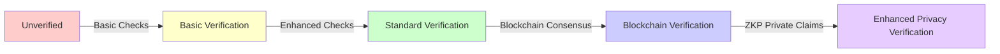

> Figure 7: Available Verification Levels for Agent Interactions
>
> This diagram illustrates the spectrum of verification levels that a user or agent can request when interacting with another agent via ANS.

### 5.4 Rapid Revocation Mechanism

ANS implementations MUST provide an emergency revocation mechanism to quickly respond to compromised agents with these capabilities:

* **Immediate Centralised Revocation**: Instant flagging in high performance layer
* **Cache Invalidation Broadcast**: Rapid invalidation of cached entries
* **Blockchain Confirmation**: Permanent record of revocation with proof and reason code
* **Notification Distribution**: Alert to affected parties
* **Audit Trail Generation**: Comprehensive logging of revocation events
* **Partial Capability Revocation**: Ability to revoke specific capabilities while maintaining others
* **Standardised Reason Codes**: Clear indication of revocation reason for informed decision-making
* **Endorsement Revocation**: Clear mechanism for revoking third-party capability endorsements

### 5.5 Privacy Preserving Verification

ANS MUST enable verification without exposing sensitive details:

* **Selective Disclosure**: Agents can prove they possess certain attributes without revealing the details
* **Zero-Knowledge Proofs**: Cryptographic verification of compliance with requirements
* **Private Attestations**: Trusted third parties can verify attributes and issue attestations
* **Capability Commitments**: Cryptographic commitments to capabilities that can be selectively revealed
* **Contextual Attestations**: Short-lived, context-specific proofs for peer-to-peer interactions

These features allow agents to prove attributes (like licenses or certifications) without revealing private data.

### 5.6 AI Supply Chain Verification

To ensure trust in the software behind agents, ANS supports detailed supply chain checks.

ANS SHOULD provide mechanisms to verify the components of AI agents:

* **AI Bill of Materials (AIBOM)**: Standardised format for documenting AI components
* **Model Provenance**: Verification of base models, training processes, and datasets
* **Vulnerability Tracking**: Integration with vulnerability databases to flag known issues
* **Development Practice Attestations**: Verification of secure development methodologies
* **AIBOM Hash Verification**: Blockchain records of AIBOM hashes for tamper evidence
* **Attestation Verification**: Validation of external certificates against certification registries
* **Supply Chain Risk Assessment**: Automated scoring of supply chain security posture

## 6. Security and Governance Capabilities

### 6.1 Data Residency and Sovereignty

> Pending legal review

ANS must support keeping agent data within specific regions or jurisdictions.

The ANS architecture MUST support data sovereignty through:

* **Regional deployment capabilities** for the high performance layer
* **Configurable data replication boundaries**
* **Metadata tagging for regional restrictions**
* **Cryptographic controls** for sensitive fields
* **Compliance with regulatory frameworks**
* **Audit trails for data access across regions**
* **Federated private instances** for maximum sovereignty
* **Data minimisation by design** for cross-instance federation
* **Support for customisable encryption key management**
* **Federation Policy Control** with fine-grained sharing rules across ANS instances

### 6.2 Identity Integration

ANS implementations SHOULD provide interfaces for integration with identity systems:

* **Integration interfaces for common directory services**
* **Support for SAML 2.0 and OIDC federation**
* **Role-based access control for agent management**
* **Attribute-based access policies**
* **Delegated administration for large organisations**
* **Just-in-time access provisioning**
* **Privileged access management**
* **Standardised user/group provisioning interfaces**
* **Conditional access integration**

This allows ANS to plug into existing enterprise identity systems.

### 6.3 Access Control

The ANS model MUST define fine-grained permission structures:

* **Resource-level permissions for agent objects**
* **Operation-level controls** (read, register, update, deregister)
* **Time-bound access grants**
* **Context-aware authorisation**
* **Hierarchical permission models**
* **Emergency access procedures**
* **Least privilege enforcement**
* **Attribute-Based Access Control (ABAC)** for dynamic, context-aware authorisation
* **Break-Glass Procedures** with comprehensive logging for emergency scenarios

### 6.4 Validator Governance

The ANS model MUST specify validator governance mechanisms:

* **Validator node deployment standards**
* **Industry-specific validation consortia framework**
* **Custom validation rule implementation**
* **Verification record management**
* **Cross-organisational trust frameworks**
* **Governance participation procedures**
* **Reputation calculation methodology**
* **Private Validation Oracle integration standards**
* **Staking/slashing mechanism standards** with transparent evidence requirements

### 6.5 Auditability Framework

ANS MUST provide comprehensive security monitoring capabilities:

* **Detailed audit logs for all operations**
* **Security monitoring integration**
* **Anomaly detection for suspicious activity**
* **Real-time security alerts**
* **Compliance reporting dashboards**
* **Standardised event IDs for cross-system correlation**
* **Immutable blockchain logs of critical operations**
* **Standardised Audit Log Formats**
* **API Call Tracing** with distributed tracing across all microservices
* **Behavioural analytics interfaces** for detecting anomalous patterns

### 6.6 Policy-Based Interaction Control

ANS MUST enable organisations to control agent interactions through:

* **Standardised policy language** (e.g. JSON, XACML) **Status**: Under Development
* **Runtime policy enforcement**
* **Organisation-level policy templates**
* **Policy inheritance hierarchies**
* **Contextual policy evaluation**
* **Compliance verification**
* **Policy conflict resolution**
* **Policy Versioning and Rollback** for change management
* **Policy Simulation/Dry-Run** to test impact before enforcement
* **Policy Compliance Reporting** for governance and audit

## 7. Protocol Integration

### 7.1 A2A Protocol Integration

ANS significantly enhances agent-to-agent communication protocols like A2A by providing robust discovery and verification mechanisms. Figure 8 illustrates a typical flow where an agent leverages ANS to securely establish an A2A session with another verified agent, potentially including the use of contextual attestations and dynamic policy negotiation.

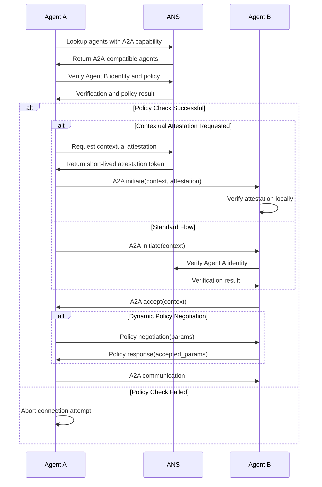

> Figure 8: ANS-Enhanced A2A Protocol Integration Flow
>
> Example flow showing how an agent (Agent A) uses ANS for discovery and verification of another agent (Agent B), potentially requesting a contextual attestation, before initiating an Agent-to-Agent (A2A) communication session. The flow also includes optional dynamic policy negotiation.

ANS enhances the A2A protocol through:

* **Discovery**: Finding A2A-compatible agents by capability
* **Verification**: Establishing trust before A2A connection
* **Policy Enforcement**: Ensuring agents only connect according to defined policies
* **Capability Matching**: Identifying compatible A2A feature sets
* **Dynamic Trust Negotiation**: Contextual trust decisions during A2A handshakes
* **Cross-Organisational Trust**: Enabling A2A communication across organisation boundaries
* **Dynamic Capability Discovery**: Support for agent-advertised capability discovery endpoints
* **Contextual Attestations**: Short-lived verification tokens for specific interaction contexts
* **Dynamic Policy Exchange/Negotiation**: Support for session-specific policy negotiation

> prototype phase

* **Policy Negotiation Endpoints**: Specialised endpoints for dynamic policy negotiation

> prototype phase

### 7.2 MCP Protocol Integration

Agent finds and uses a Model-as-a-Tool via MCP, using ANS to verify the server.
For AI models interacting with external tools via the Model Context Protocol (MCP), ANS provides a crucial layer for discovering and verifying MCP servers. Figure 9 depicts how an agent can use ANS to find suitable MCP tools and establish a trusted connection with the MCP server.

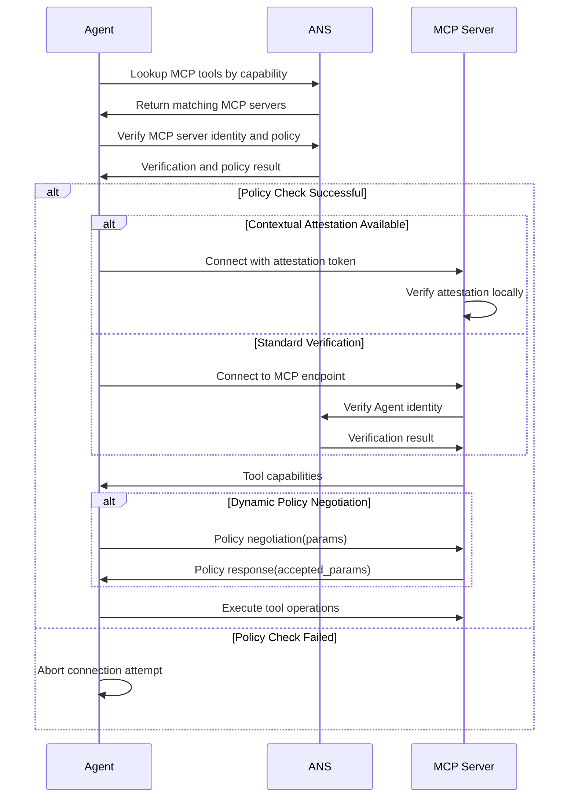

> Figure 9: ANS-Enhanced MCP Protocol Integration Flow
>
> Illustrates how an agent uses ANS to discover and verify an MCP server and its tools. The process can include policy checks, contextual attestations, and dynamic policy negotiation before the agent connects to the MCP endpoint to execute tool operations.

ANS enhances the MCP protocol through:

* **Tool Discovery**: Finding appropriate MCP tools for specific tasks
* **Server Verification**: Verifying MCP server authenticity
* **Capability Exchange**: Learning available operations from verified servers
* **Policy-Based Access**: Enforcing access policies for MCP tools
* **Interaction Policy Discovery**: Learning usage rules before connection
* **Trust-Based Authorisation**: Adjusting tool access based on verified trust level
* **Dynamic Capability Endorsement**: Supporting verified third-party endorsements of capabilities
* **Contextual Attestations**: Short-lived verification tokens for specific interaction contexts
* **Capability Endorsement Revocation**: Clear mechanism for revoking third-party endorsements
* **Dynamic Policy Exchange**: Support for session-specific policy negotiation

### 7.3 Standardised Capability Taxonomy

ANS defines a standard taxonomy so that agents can advertise known capabilities in a common way.
ANS MUST implement a standardised taxonomy for agent capabilities with governance mechanisms. The following is a sample structure for such a taxonomy.

```json
{
  "capability_taxonomy": {
    "version": "2.0",
    "governance": {
      "authority": "ANS Capability Standards Committee",
      "change_process": "https://ans.io/governance/capability-taxonomy",
      "review_cycle": "quarterly"
    },
    "a2a": {
      "protocols": ["a2a_v1", "a2a_v2"],
      "streaming": true,
      "supported_artifacts": ["text", "image", "code", "custom_formats"],
      "security_levels": ["basic", "enhanced", "zero_trust"]
    },
    "mcp": {
      "tool_types": ["filesystem", "database", "api", "websearch", "code_execution"],
      "supported_formats": ["text/plain", "application/json", "image/*"],
      "authentication_methods": ["token", "oauth", "api_key"]
    },
    "dynamic_capabilities": {
      "discovery_endpoint": "https://agent-id.example.ans/capabilities",
      "discovery_authorization": "bearer|oauth|signature",
      "update_frequency": "daily|weekly|on-demand",
      "verification_mechanism": "signature|validator_attestation|blockchain"
    },
    "capability_endorsement": {
      "endorsers": ["trusted_verifier_1", "industry_consortium_A"],
      "endorsement_mechanism": "blockchain|signature|attestation",
      "revocation_mechanism": "blockchain|revocation_list|time_bound",
      "verification_endpoint": "https://endorsement.example.ans/verify"
    }
  }
}
```

### 7.4 Cross-Protocol Workflow Examples

ANS enables advanced multi-protocol agent workflows:

#### Delegated Task Execution:

An example where Agent A, after discovery and verification of Agent B, delegates work to B, which in turn uses MCP tools before returning results.

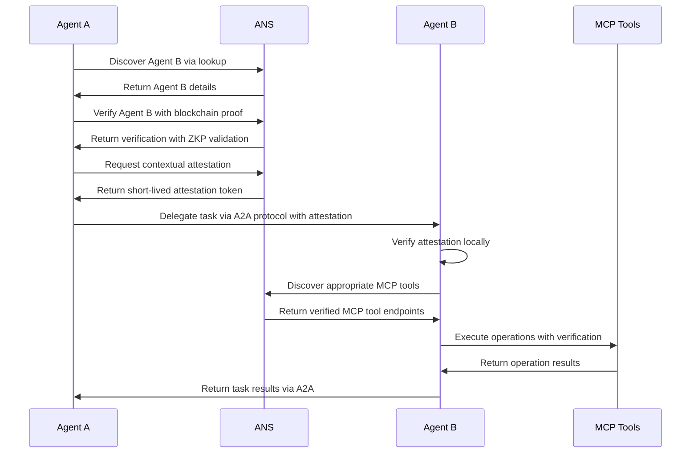

> Figure 10: Delegated Task Execution Workflow with ANS
>
> Demonstrates a complex scenario where Agent A discovers and verifies Agent B using ANS (including ZKP and contextual attestations), delegates a task via A2A. Agent B, in turn, uses ANS to discover and verify appropriate MCP tools to perform its sub-tasks before returning results to Agent A.

#### Multi-Agent Collaboration:

In scenarios involving collaboration between multiple specialised agents, an orchestrator can leverage ANS to manage discovery, verification, and connection establishment. Figure 11 depicts such a multi-agent collaboration, highlighting how ANS underpins each stage of interaction and tool usage.

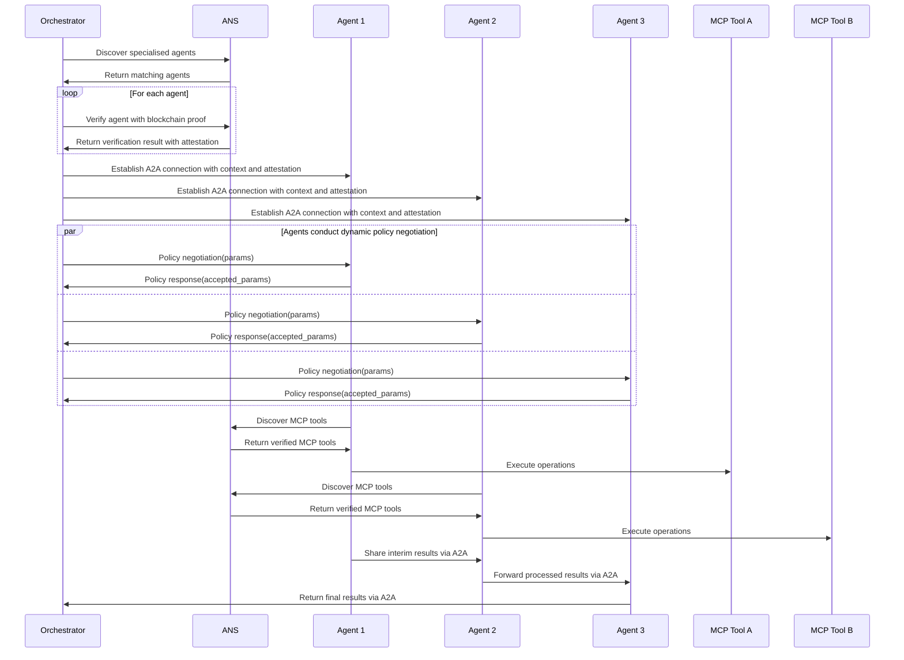

> Figure 11: Multi-Agent Collaboration Workflow with ANS
>
> Shows an orchestrator discovering, verifying (with attestations), and establishing A2A connections with multiple specialised agents after dynamic policy negotiation. These agents may then independently use ANS to discover MCP tools for their respective tasks, collaborate, and return final results to the orchestrator.

## 8. Implementation Considerations

### 8.1 Architecture Design Patterns

The following patterns can help developers build ANS-compliant systems.
Implementations of the ANS specification SHOULD consider the following architectural patterns:

#### 8.1.1 Centralised Layer Patterns

* **API Gateway Pattern**: Implementations SHOULD use a globally distributed API gateway architecture capable of routing requests, enforcing rate limits, and providing authentication services.
* **Distributed Database Pattern**: A horizontally scalable, globally distributed database architecture SHOULD be employed to handle the high-volume, read-heavy workload typical of agent lookups.
* **Multi-Region Cache Pattern**: Implementations SHOULD incorporate a distributed caching architecture to minimise latency for frequent lookups and reduce database load.
* **Federated Identity Pattern**: Authentication services SHOULD leverage federated identity patterns to enable integration with diverse identity providers.
* **Metrics Collection Pattern**: Observability systems SHOULD implement distributed collection with centralised aggregation for global monitoring.

#### 8.1.2 Bridge Layer Patterns

* **Event-Driven Synchronisation Pattern**: The Synchronisation Engine SHOULD use event-driven architecture for robustness and scalability.
* **Conflict Resolution Pattern**: Implementations SHOULD employ hierarchical resolution strategies with clear escalation paths.
* **Trust Protocol Pattern**: Implementations SHOULD use multi-layered verification with progressive validation steps.
* **Policy Distribution Pattern**: Implementations SHOULD use eventual consistency with priority-based updates for policy changes.

#### 8.1.3 Decentralised Layer Patterns

* **Blockchain Integration Pattern**: Implementations MAY support multiple blockchain architectures through adapter interfaces.
* **Validator Consensus Pattern**: Implementations SHOULD use Byzantine Fault Tolerant consensus algorithms for validator networks.
* **Smart Contract Pattern**: Verification rules SHOULD be encoded in transparent, auditable smart contracts.
* **Reputation System Pattern**: Validator quality SHOULD be tracked through reputation systems with appropriate weighting.
* **Zero-Knowledge Pattern**: Implementations SHOULD support standardised ZKP protocols for private verification.

### 8.2 Deployment Models

ANS supports multiple deployment models:

* **Global Public ANS**: Globally available registry for public agents
* **Private ANS**: Dedicated deployment for organisational use
* **Industry Consortium ANS**: Shared registry for specific industry verticals
* **Hybrid Federated ANS**: Private instances with limited federation
* **Multi-Region ANS**: Deployment with regional data boundaries for compliance
* **Customer-Managed Keys ANS**: Deployment with customer-managed encryption keys

### 8.3 Performance and Scalability Considerations

Implementations of the ANS specification SHOULD design for:

* **Agent Record Scale**: Infrastructure capable of handling billions of registered agents
* **Lookup Throughput**: Optimisation for high-volume queries (100,000+ per second)
* **Global Latency**: Achieve <50ms p95 latency via global caching and edge nodes.
* **Verification Performance**: Efficient verification processing (10,000+ per second)
* **Registration Throughput**: Reliable processing of new registrations (1,000+ per second)
* **Blockchain Efficiency**: Optimised batching for high transaction volume
* **Federation Scale**: Support for federating with numerous ANS instances
* **Disaster Recovery**: Clear RPO/RTO targets for different operation types
* **Degradation Strategies**: Progressive performance degradation rather than outage

Implementations SHOULD publish performance characteristics and SLAs appropriate to their deployment model.

## 9. Benefits and Use Cases

### 9.1 Ecosystem Benefits

* **Secure Integration**: Verify third-party agents before integration
* **Standardised Discovery**: Consistent mechanism for finding external agents
* **Governance**: Clear verification standards for agent deployment
* **Auditability**: Immutable record of agent verification history
* **Regulatory Compliance**: Support for data sovereignty and industry regulations
* **Risk Management**: Granular control over agent interactions
* **Privacy Protection**: Selective disclosure mechanisms for sensitive attributes
* **Supply Chain Security**: Verification of AI components and dependencies

### 9.2 Developer Benefits

* **Simplified Discovery**: Easy mechanism to find and integrate with other agents
* **Trust Verification**: Confidence in third-party agent authenticity
* **Standardised Interface**: Consistent API for agent publishing and discovery
* **Ecosystem Participation**: Straightforward path to join the agent ecosystem
* **Reduced Integration Effort**: Common patterns for agent-to-agent communication
* **Enhanced Security**: Built-in verification for agent interactions
* **Dynamic Capabilities**: Support for evolving agent functionality
* **Standardised Policies**: Clear rules for agent interaction

### 9.3 Key Use Cases

* **Cross-Organisation Collaboration**: Agents automatically discovering and interacting with partner organisation agents
* **Service Marketplace**: Agents finding specialised service providers for specific tasks
* **AI Supply Chain**: Complex workflows spanning multiple specialised agents
* **Trust-Critical Operations**: Verified agent interaction for high-value or sensitive operations
* **Industry Ecosystems**: Domain-specific agent networks with shared trust frameworks
* **Regulatory Compliance**: Auditable agent interactions for regulated industries
* **Privacy-Preserving Collaboration**: Selective disclosure of capabilities for sensitive operations
* **Dynamic Agent Discovery**: Runtime discovery and verification of specialised capabilities

## 10. Conclusion and Future Work

The Agent Network System (ANS) specification provides a comprehensive model for the emerging AI agent ecosystem, enabling secure, efficient discovery and verification of agents at global scale. By combining high performance centralised components with the trust guarantees of blockchain technology, the ANS architecture delivers a hybrid approach that meets the diverse needs of the AI agent community.

As AI agents proliferate across organisations and use cases, implementations of this specification can serve as the connective tissue that enables them to find, verify, and communicate with each other. The focus on performance, trust, security, and global scalability creates a foundation that can grow with the rapidly evolving agent landscape.

Through open standards and decentralised governance, the ANS model aims to become a collaborative global resource that accelerates the development and adoption of AI agents while ensuring security and trust. By providing a common framework for agent discovery and verification, this specification can help unleash the full potential of agent-to-agent collaboration.

This specification is offered as a foundation for industry collaboration. Future work should include:

1. Formalisation through a recognised standards body
2. Development of open source reference implementations
3. Establishment of a cross industry governance model
4. Creation of conformance test suites and certification processes

The authors invite contribution from the broader AI community to refine and evolve this specification to meet the needs of a diverse and rapidly growing agent ecosystem.

## 11. Milestone-Driven Roadmap

The Agent Network System (ANS) v0.1.0 specification represents the foundational blueprint for a secure and interoperable AI agent ecosystem. Its evolution will be a community driven effort. We envision a phased approach to development, implementation, and standardisation. This roadmap outlines key milestones and invites collaboration from developers, researchers, organisations, and standards bodies.

Phase 1: Foundation & Community Building

Phase 2: Core Implementation & Protocol Refinement

Phase 3: Ecosystem Expansion & Standardization Efforts

Phase 4: Global Adoption & Advanced Capabilities

| Milestone                 | Deliverables                                            |
| ------------------------- | ------------------------------------------------------- |
| v0.2.0 Draft Release      | Complete Threat Model & Security Assumptions section    |
|                           | Initial Performance Model (latency & QPS targets)       |
| Community Review I        | Public RFC (security, performance)                      |
|                           | Solicit feedback via GitHub Issues / mailing list       |
| Policy Grammar v0.1       | Publish formal policy-language spec (syntax + examples) |
|                           | Add sample JSON/XACML snippets                          |
| Governance Spec v0.1      | Detailed consensus algorithm choice & rationale         |
|                           | Validator onboarding/safeguard procedures               |
| SDK & Reference Impl      | Release a minimal ANS node prototype                    |
|                           | Provide Postman/OpenAPI playground                      |
| Interoperability Guide    | End-to-end integration examples (REST, gRPC, DNS)       |
|                           | How-to with third-party systems                         |
| v1.0.0 “Stable” Release | Consolidate all feedback & finalize spec                |
|                           | Cut v1.0.0; declare production-ready                    |

## Appendix A: API Interface Examples

This appendix provides additional API interface examples to assist implementers.

### JavaScript Interface Example

```javascript
// Initialize the ANS client
const ans = new AgentNetworkSystem({
  credentials: { /* authentication details */ },
  registryEndpoint: "https://registry.ans.io"
});

// Lookup agents by capability
const agents = await ans.lookup({
  capabilities: ["sales_support"],
  trustLevel: "verified",
  policyRequirements: {
    verificationLevel: "standard",
    capabilities: ["secure_messaging"]
  }
});

// Register a new agent
await ans.register({
  agentId: "my-agent.example.ans",
  name: "My Agent",
  capabilities: ["customer_support"],
  endpoints: { 
    a2a: "https://my-agent.example.com/a2a",
    policy_negotiation: "https://my-agent.example.com/policy/negotiate"
  },
  privateClaims: {
    capabilityProofs: {
      "financial_transactions_level_3": "<ZKP commitment>"
    }
  },
  supplyChain: {
    aibomUrl: "https://sbom.example.com/agent-components.json",
    aibomHash: "sha256:a1b2c3d4e5f6..."
  }
});

// Verify an agent
const verification = await ans.verify({
  agentId: "nia.example.ans",
  level: "blockchain",
  requiredClaims: ["identity", "capabilities"],
  privateClaimRequests: ["financial_transactions_level_3"],
  contextualAttestation: {
    requested: true,
    validDuration: "15m",
    useContext: "payment_session_12345"
  }
});
```

### Python Interface Example

```python
# Initialize the ANS client
from ans_sdk import AgentNetworkSystem

ans = AgentNetworkSystem(
    credentials={"api_key": "your_api_key"},
    registry_endpoint="https://registry.ans.io"
)

# Lookup agents by capability
agents = ans.lookup(
    capabilities=["sales_support"],
    trust_level="verified",
    policy_requirements={
        "verification_level": "standard",
        "capabilities": ["secure_messaging"]
    }
)

# Register a new agent
ans.register(
    agent_id="my-agent.example.ans",
    name="My Agent",
    capabilities=["customer_support"],
    endpoints={
        "a2a": "https://my-agent.example.com/a2a",
        "policy_negotiation": "https://my-agent.example.com/policy/negotiate"
    },
    private_claims={
        "capability_proofs": {
            "financial_transactions_level_3": "<ZKP commitment>"
        }
    },
    supply_chain={
        "aibom_url": "https://sbom.example.com/agent-components.json",
        "aibom_hash": "sha256:a1b2c3d4e5f6..."
    }
)

# Verify an agent
verification = ans.verify(
    agent_id="nia.example.ans",
    level="blockchain",
    required_claims=["identity", "capabilities"],
    private_claim_requests=["financial_transactions_level_3"],
    contextual_attestation={
        "requested": True,
        "valid_duration": "15m",
        "use_context": "payment_session_12345"
    }
)
```

## Appendix B: Protocol Integration Examples

### B.1 A2A Protocol Integration

```javascript
// Using ANS with A2A protocol
const ans = new AgentNetworkSystem({
  credentials: { /* authentication details */ },
  registryEndpoint: "https://registry.ans.io"
});

// Find an agent that supports A2A
const agents = await ans.lookup({
  capabilities: ["document_processing"],
  protocols: ["a2a"]
});

// Verify the agent before connecting
const verification = await ans.verify({
  agentId: agents[0].agent_id,
  level: "standard",
  required_claims: ["identity", "capabilities"],
  interaction_context: "document_processing",
  contextualAttestation: {
    requested: true,
    validDuration: "15m",
    useContext: "document_session_5678"
  }
});

// Check policy compliance
if (verification.verified && verification.policy_compliance.compliant) {
  // Connect via A2A protocol with verification attestation token
  const a2aClient = new A2AClient();
  const connection = await a2aClient.connect(
    agents[0].endpoints.a2a,
    {
      attestation_token: verification.contextual_attestation.token,
      context: "document_processing_request"
    }
  );
  
  // Dynamic policy negotiation
  if (agents[0].endpoints.policy_negotiation) {
    const negotiation = await a2aClient.negotiatePolicy(
      agents[0].endpoints.policy_negotiation,
      {
        retention_period: "15d",  // Proposing a shorter retention
        purpose_limitation: ["document_analysis_only"]
      }
    );
  
    if (negotiation.accepted) {
      console.log("Policy negotiated successfully:", negotiation.accepted_parameters);
    }
  }
  
  // Proceed with A2A communication
  await connection.sendTask({
    task_type: "document_analysis",
    document: documentData
  });
} else {
  console.log("Agent verification failed or policy not compliant:", 
              verification.policy_compliance.reason);
}
```

### B.2 MCP Protocol Integration

```python
# Using ANS with MCP protocol
from ans_sdk import AgentNetworkSystem
from mcp_client import MCPClient

ans = AgentNetworkSystem(
    credentials={"api_key": "your_api_key"},
    registry_endpoint="https://registry.ans.io"
)

# Find MCP servers with specific capabilities
mcp_servers = ans.lookup(
    capabilities=["code_generation"],
    protocols=["mcp"],
    trust_level="verified"
)

if mcp_servers:
    # Verify the MCP server and check policy compliance
    verification = ans.verify(
        agent_id=mcp_servers[0].agent_id,
        level="blockchain",
        interaction_context="code_generation_request",
        contextual_attestation={
            "requested": True,
            "valid_duration": "30m",
            "use_context": "coding_session_9012"
        }
    )
  
    if verification.verified and verification.policy_compliance.compliant:
        # Connect to the MCP server with contextual attestation
        mcp_client = MCPClient()
        server = mcp_client.connect(
            mcp_servers[0].endpoints.mcp,
            attestation_token=verification.contextual_attestation.token
        )
  
        # Dynamic policy negotiation if supported
        if hasattr(mcp_servers[0].endpoints, "policy_negotiation"):
            negotiation = mcp_client.negotiate_policy(
                mcp_servers[0].endpoints.policy_negotiation,
                {
                    "retention_period": "7d",  # Proposing a shorter retention
                    "purpose_limitation": ["code_generation_only"]
                }
            )
  
            if negotiation.accepted:
                print(f"Policy negotiated successfully: {negotiation.accepted_parameters}")
  
        # Discover available tools first
        tools = server.discover_tools()
  
        # Use the MCP server's capabilities
        if "generate_code" in tools:
            result = server.execute_tool(
                "generate_code",
                {
                    "language": "python",
                    "description": "A function to sort a list"
                }
            )
    else:
        print(f"Server verification failed or policy not compliant: {verification.policy_compliance.reason}")
```

## Appendix C: Smart Contract Reference Designs

The following reference designs illustrate how the ANS verification and policy management can be implemented as smart contracts. These designs focus on security properties and formal behaviour rather than specific implementation details.

### C.1 Verification Registry Contract

```solidity
// VerificationRegistry.sol
// SPDX-License-Identifier: MIT
pragma solidity ^0.8.0;

import "@openzeppelin/contracts/access/AccessControl.sol";
import "@openzeppelin/contracts/security/ReentrancyGuard.sol";

contract AgentVerificationRegistry is AccessControl, ReentrancyGuard {
    bytes32 public constant VALIDATOR_ROLE = keccak256("VALIDATOR_ROLE");
    bytes32 public constant ADMIN_ROLE = keccak256("ADMIN_ROLE");
  
    struct VerificationRecord {
        bytes32 agentId;
        string verificationLevel;
        bytes32 claimsHash;
        uint256 timestamp;
        address verifier;
        bool revoked;
        string revocationReason;
        bytes32[] revokedCapabilities;
    }
  
    // Mapping from agent ID hash to verification record
    mapping(bytes32 => VerificationRecord) public verifications;
  
    // Validator reputation tracking
    mapping(address => uint256) public validatorReputation;
    mapping(address => uint256) public validatorLastActivity;
    mapping(address => uint256) public validatorSuccessfulVerifications;
  
    // AIBOM hash verification
    mapping(bytes32 => bytes32) public agentAibomHashes;
  
    // Events
    event VerificationRecorded(bytes32 indexed agentId, string level, bytes32 claimsHash);
    event VerificationRevoked(bytes32 indexed agentId, string reason, uint256 timestamp);
    event CapabilitiesRevoked(bytes32 indexed agentId, bytes32[] capabilities, uint256 timestamp);
    event ValidatorAdded(address indexed validator);
    event ValidatorRemoved(address indexed validator);
    event ValidatorReputationUpdated(address indexed validator, uint256 newReputation);
    event ValidatorSlashed(address indexed validator, uint256 amount, string evidence);
    event AibomHashRecorded(bytes32 indexed agentId, bytes32 aibomHash);
    event SyncProofRecorded(bytes32 merkleRoot, uint256 timestamp, uint256 recordCount);
  
    constructor() {
        _setupRole(DEFAULT_ADMIN_ROLE, msg.sender);
        _setupRole(ADMIN_ROLE, msg.sender);
    }
  
    modifier onlyAdmin() {
        require(hasRole(ADMIN_ROLE, msg.sender), "Only admin can call this function");
        _;
    }
  
    modifier onlyValidator() {
        require(hasRole(VALIDATOR_ROLE, msg.sender), "Only validators can call this function");
        _;
    }
  
    function addValidator(address validator) external onlyAdmin {
        grantRole(VALIDATOR_ROLE, validator);
        validatorReputation[validator] = 100; // Initial reputation
        emit ValidatorAdded(validator);
    }
  
    function removeValidator(address validator) external onlyAdmin {
        revokeRole(VALIDATOR_ROLE, validator);
        emit ValidatorRemoved(validator);
    }
  
    function recordVerification(
        bytes32 agentId,
        string calldata level,
        bytes32 claimsHash,
        bytes32[] calldata capabilityHashes,
        bytes32 aibomHash
    ) external onlyValidator nonReentrant returns (bool) {
        // Check if agent exists and handle appropriately
        bool isNewAgent = verifications[agentId].agentId == bytes32(0);
  
        // For existing agents, check if they're revoked
        if (!isNewAgent && verifications[agentId].revoked) {
            return false;
        }
  
        // Record verification
        verifications[agentId] = VerificationRecord({
            agentId: agentId,
            verificationLevel: level,
            claimsHash: claimsHash,
            timestamp: block.timestamp,
            verifier: msg.sender,
            revoked: false,
            revocationReason: "",
            revokedCapabilities: new bytes32[](0)
        });
  
        // If AIBOM hash provided, record it
        if (aibomHash != bytes32(0)) {
            agentAibomHashes[agentId] = aibomHash;
            emit AibomHashRecorded(agentId, aibomHash);
        }
  
        // Update validator metrics
        validatorLastActivity[msg.sender] = block.timestamp;
        validatorSuccessfulVerifications[msg.sender]++;
  
        // Update reputation (simplified - would be more complex in reality)
        if (validatorSuccessfulVerifications[msg.sender] % 10 == 0) {
            validatorReputation[msg.sender] += 5;
            emit ValidatorReputationUpdated(msg.sender, validatorReputation[msg.sender]);
        }
  
        emit VerificationRecorded(agentId, level, claimsHash);
        return true;
    }
  
    function revokeVerification(
        bytes32 agentId, 
        string calldata reason
    ) external onlyValidator nonReentrant {
        require(verifications[agentId].agentId == agentId, "Agent not found");
        require(!verifications[agentId].revoked, "Already revoked");
  
        verifications[agentId].revoked = true;
        verifications[agentId].revocationReason = reason;
  
        emit VerificationRevoked(agentId, reason, block.timestamp);
    }
  
    function revokeCapabilities(
        bytes32 agentId,
        bytes32[] calldata capabilities,
        string calldata reason
    ) external onlyValidator nonReentrant {
        require(verifications[agentId].agentId == agentId, "Agent not found");
        require(!verifications[agentId].revoked, "Agent fully revoked");
  
        verifications[agentId].revokedCapabilities = capabilities;
  
        emit CapabilitiesRevoked(agentId, capabilities, block.timestamp);
    }
  
    function recordSyncProof(
        bytes32 merkleRoot,
        uint256 recordCount
    ) external onlyValidator nonReentrant {
        // Record a proof of synchronisation between centralised DB and blockchain
        emit SyncProofRecorded(merkleRoot, block.timestamp, recordCount);
    }
  
    function checkVerification(bytes32 agentId) external view 
        returns (
            string memory level,
            uint256 timestamp,
            address verifier,
            bool isRevoked,
            string memory revocationReason,
            bytes32[] memory revokedCapabilities,
            bytes32 aibomHash
        ) 
    {
        VerificationRecord memory record = verifications[agentId];
        require(record.agentId == agentId, "Agent not verified");
  
        return (
            record.verificationLevel,
            record.timestamp,
            record.verifier,
            record.revoked,
            record.revocationReason,
            record.revokedCapabilities,
            agentAibomHashes[agentId]
        );
    }
  
    function verifyClaimsHash(bytes32 agentId, bytes32 claimsHash) external view returns (bool) {
        VerificationRecord memory record = verifications[agentId];
  
        // Must be verified and not revoked
        if (record.agentId != agentId || record.revoked) {
            return false;
        }
  
        return record.claimsHash == claimsHash;
    }
  
    function verifyAibomHash(bytes32 agentId, bytes32 aibomHash) external view returns (bool) {
        // If no AIBOM recorded, return false
        if (agentAibomHashes[agentId] == bytes32(0)) {
            return false;
        }
  
        return agentAibomHashes[agentId] == aibomHash;
    }
  
    function isCapabilityRevoked(bytes32 agentId, bytes32 capability) external view returns (bool) {
        VerificationRecord memory record = verifications[agentId];
  
        // If agent is fully revoked, all capabilities are revoked
        if (record.revoked) {
            return true;
        }
  
        // Check if specific capability is revoked
        for (uint i = 0; i < record.revokedCapabilities.length; i++) {
            if (record.revokedCapabilities[i] == capability) {
                return true;
            }
        }
  
        return false;
    }
  
    function slashValidator(
        address validator, 
        uint256 amount, 
        string calldata evidence
    ) external onlyAdmin {
        require(hasRole(VALIDATOR_ROLE, validator), "Address is not a validator");
        require(validatorReputation[validator] >= amount, "Reputation underflow");
  
        validatorReputation[validator] -= amount;
        emit ValidatorReputationUpdated(validator, validatorReputation[validator]);
        emit ValidatorSlashed(validator, amount, evidence);
  
        // If reputation falls too low, consider removing validator role
        if (validatorReputation[validator] < 50) {
            revokeRole(VALIDATOR_ROLE, validator);
            emit ValidatorRemoved(validator);
        }
    }
}
```

### C.2 Smart Contract Formal Security Properties

The smart contracts in the ANS model MUST adhere to the following security properties:

#### C.2.1 Authentication

* Only administrators can add/remove validators
* Only validators can record verifications
* Only administrators can slash validators

#### C.2.2 Immutability

* Once recorded, verification records cannot be modified
* Revocation can only add information, never remove it
* Capability revocation can only add revoked capabilities, never remove them

#### C.2.3 Transparency

* All verification operations emit corresponding events
* All validator management operations emit corresponding events
* All slashing operations include evidence references

#### C.2.4 Non-Repudiation

* All operations record the sender's address
* Verification records include a timestamp
* Events contain all necessary audit information

#### C.2.5 Liveness

* Validator incentives increase with successful verifications
* Higher reputation leads to higher influence in consensus
* Inactivity penalties encourage regular participation

## Appendix D: Security Considerations

### D.1 Threat Model

**Status**: Under Development

The ANS system is designed with a comprehensive threat model that maps specific threats to required mitigation mechanisms. Table D.1 provides a formal threat matrix with explicit links between each threat vector and its corresponding mitigation implementation.

**Table D.1: Threat Matrix with Linked Mitigations**

| Threat Category               | Specific Threat              | Impact   | Likelihood | Mitigation Mechanism                                      | Implementation Reference                        |
| ----------------------------- | ---------------------------- | -------- | ---------- | --------------------------------------------------------- | ----------------------------------------------- |
| **Impersonation**       | Agent spoofing               | High     | Medium     | Multi-level verification with progressive trust           | `VerifyAgentWithProgressiveTrust()` algorithm |
|                               | Validator impersonation      | Critical | Low        | Validator reputation system with slashing                 | `ValidatorReputationSystem` in smart contract |
|                               | Endpoint forgery             | High     | Medium     | Endpoint validation with challenge-response               | `VerifyEndpoint()` in verification protocol   |
| **Denial of Service**   | API flooding                 | Medium   | High       | Rate limiting with circuit breakers                       | Registry Gateway component                      |
|                               | Blockchain congestion        | Medium   | Medium     | Transaction batching with priority queues                 | `SubmitToBlockchain()` algorithm              |
|                               | Validator saturation         | Medium   | Low        | Dynamic validator selection                               | `SelectEligibleValidators()` function         |
| **Man-in-the-Middle**   | Registry response tampering  | High     | Low        | Signed responses with blockchain verification             | `GenerateCryptographicProof()` algorithm      |
|                               | Attestation interception     | High     | Low        | Short-lived context-bound tokens                          | `GenerateContextualAttestation()` algorithm   |
| **Replay Attacks**      | Verification replay          | Medium   | Medium     | Timestamped nonces in all requests                        | Request preparation in all algorithms           |
|                               | Attestation reuse            | High     | Medium     | Context binding with expiration                           | `GenerateContextualAttestation()` algorithm   |
| **Trust Forgery**       | False capability claims      | High     | Medium     | Capability endorsement with blockchain proof              | `VerifyCapabilitiesNotRevoked()` function     |
|                               | Fabricated attestations      | Critical | Low        | Cryptographic signature verification                      | Basic verification in `VerifyBasicLevel()`    |
| **Data Poisoning**      | Malicious agent records      | High     | Medium     | Strict validation with Validator consensus                | `VerifyWithValidators()` algorithm            |
|                               | Invalid capability updates   | Medium   | Medium     | Risk-based conflict resolution                            | `CalculateRiskScore()` algorithm              |
| **Validator Collusion** | Colluding validators         | Critical | Low        | Diversity requirements with reputation-weighted influence | `CalculateWeightedConsensus()` function       |
|                               | Malicious majority           | Critical | Very Low   | Transparent slashing with evidence                        | `slashValidator()` in smart contract          |
| **Regional Bypass**     | Data residency violation     | High     | Medium     | Cryptographic controls with geo-fencing                   | Policy Distribution Module                      |
|                               | Regional isolation bypass    | Medium   | Low        | Immutable access logs on blockchain                       | Audit trail in all components                   |
| **Metadata Leakage**    | Sensitive info in federation | Medium   | High       | Data minimisation with selective sharing                  | `FilterFederatedAttributes()` function        |
|                               | Context leakage              | Medium   | Medium     | Zero-knowledge proofs for sensitive claims                | `VerifyZeroKnowledgeProofs()` algorithm       |
| **API Exploitation**    | Parameter injection          | High     | High       | Input validation with strict type checking                | Implemented in all API endpoints                |
|                               | Method confusion             | Medium   | Medium     | Method-specific authentication                            | `Authentication Service` component            |

### D.2 Zero-Trust Implementation

The ANS system implements zero-trust principles at all levels:

* **Authentication**: Every request requires authentication with time-limited credentials
* **Authorisation**: Fine-grained access control for all registry operations
* **Continuous Verification**: Ongoing validation of agent claims and status
* **Least Privilege**: Minimal access rights for each system component
* **Micro-segmentation**: Isolation between system components and services
* **Encryption**: End-to-end encryption for all sensitive data
* **Monitoring**: Comprehensive audit logs and anomaly detection
* **Circuit Breakers**: Automatic isolation of compromised or suspicious components
* **Identity-Based Security**: Security policies tied to verified identities rather than network location
* **Session Context**: Security decisions incorporating full request context

### D.3 Formal Threat Response Protocol

```pseudocode
ALGORITHM ThreatDetectionAndResponse(detectedThreat)
  // Structured response to detected security threats
  BEGIN
    // 1. Categorise threat and determine severity
    threatCategory ← CategorizeThreat(detectedThreat)
    severityLevel ← CalculateThreatSeverity(detectedThreat, threatCategory)
  
    // 2. Apply immediate containment based on threat category
    IF threatCategory == "IMPERSONATION" THEN
      containmentAction ← FlagAgentAsCompromised(detectedThreat.agentId)
    ELSIF threatCategory == "DENIAL_OF_SERVICE" THEN
      containmentAction ← ApplyCircuitBreaker(detectedThreat.targetComponent)
    ELSIF threatCategory == "TRUST_FORGERY" THEN
      containmentAction ← EmergencyRevokeVerification(detectedThreat.agentId)
    ELSIF threatCategory == "VALIDATOR_COLLUSION" THEN
      containmentAction ← QuarantineValidators(detectedThreat.validatorSet)
    ELSE
      containmentAction ← ApplyDefaultContainment(detectedThreat)
    END IF
  
    // 3. Generate standardised incident record with evidence
    incidentRecord ← {
      "incident_id": GenerateUUID(),
      "timestamp": CurrentTimestamp(),
      "threat_category": threatCategory,
      "severity": severityLevel,
      "affected_components": detectedThreat.affectedComponents,
      "affected_agents": detectedThreat.affectedAgents,
      "detection_source": detectedThreat.source,
      "evidence": CollectEvidence(detectedThreat),
      "containment_action": containmentAction,
      "containment_status": "APPLIED"
    }
  
    // 4. Record incident immutably
    StoreIncidentRecord(incidentRecord)
  
    // For critical severity, record hash on blockchain 
    IF severityLevel == "CRITICAL" THEN
      RecordIncidentHashOnBlockchain(Hash(incidentRecord))
    END IF
  
    // 5. Notify appropriate stakeholders based on severity
    notificationTargets ← DetermineNotificationTargets(severityLevel, detectedThreat)
    SendStructuredAlert(notificationTargets, incidentRecord)
  
    // 6. Initiate investigation workflow
    investigationTicket ← InitiateInvestigation(incidentRecord)
  
    // 7. Apply mitigation from threat matrix
    mitigationReference ← GetMitigationFromThreatMatrix(threatCategory, detectedThreat.specificThreat)
    mitigationStatus ← ApplyMitigation(mitigationReference, detectedThreat)
  
    // 8. Update incident record with mitigation status
    UpdateIncidentRecord(incidentRecord.incident_id, {
      "mitigation_reference": mitigationReference,
      "mitigation_status": mitigationStatus,
      "investigation_reference": investigationTicket.id
    })
  
    // 9. Return incident summary
    RETURN {
      "incident_id": incidentRecord.incident_id,
      "severity": severityLevel,
      "containment_status": "APPLIED",
      "investigation_reference": investigationTicket.id
    }
  END
```

## Appendix E: AIBOM Format Specification

**Status**: Under Development

The AI Bill of Materials (AIBOM) format standardises the documentation of AI components:

```json
{
  "aibom_version": "1.0",
  "agent_id": "example-agent.ans",
  "agent_version": "2.5.1",
  "created_date": "2025-04-12T10:30:00Z",
  "last_updated": "2025-05-17T14:22:31Z",
  "components": [
    {
      "type": "model",
      "id": "foundation-model-123",
      "name": "FoundationLLM",
      "version": "3.0",
      "provider": "AI Foundation Co",
      "license": "commercial",
      "usage_purpose": "core_reasoning",
      "attestations": [
        {
          "type": "safety_testing", 
          "authority": "AI Safety Institute", 
          "id": "cert-12345",
          "validity_url": "https://aisafety.org/verify/cert-12345",
          "valid_until": "2026-04-12T00:00:00Z"
        },
        {
          "type": "security_audit", 
          "authority": "SecureAI Labs", 
          "id": "audit-78901",
          "validity_url": "https://secureailabs.com/verify/audit-78901"
        }
      ]
    },
    {
      "type": "dataset",
      "id": "training-dataset-456",
      "name": "Industry Knowledge Base",
      "version": "2023-Q2",
      "characteristics": {
        "domain": "financial_services",
        "size": "500GB",
        "record_count": 12500000,
        "time_period": "2010-2023"
      },
      "processing": [
        {"type": "anonymisation", "method": "differential_privacy"},
        {"type": "filtering", "criteria": "regulatory_compliance"}
      ],
      "attestations": [
        {
          "type": "data_quality", 
          "authority": "DataTrust Inc", 
          "id": "quality-34567",
          "validity_url": "https://datatrust.org/verify/quality-34567"
        }
      ]
    },
    {
      "type": "framework",
      "id": "ai-framework-789",
      "name": "SecureAI Framework",
      "version": "4.2.1",
      "license": "apache-2.0",
      "components": ["runtime", "security_layer", "validation_engine"]
    }
  ],
  "development_process": {
    "methodology": "secure_development_lifecycle",
    "testing": [
      {"type": "adversarial_testing", "coverage": "high", "last_performed": "2025-03-15"},
      {"type": "red_teaming", "coverage": "medium", "last_performed": "2025-04-01"}
    ],
    "attestations": [
      {
        "type": "development_process", 
        "authority": "AIDevSecOps", 
        "id": "process-56789",
        "validity_url": "https://aidevsecops.com/verify/process-56789",
        "valid_until": "2026-05-17T00:00:00Z"
      }
    ]
  },
  "known_vulnerabilities": [],
  "supply_chain_risk_assessment": {
    "overall_risk_level": "low",
    "risk_factors": [
      {
        "factor": "foundation_model_security",
        "score": "low",
        "rationale": "Model has undergone independent security audit"
      },
      {
        "factor": "data_provenance",
        "score": "medium",
        "rationale": "Some datasets have limited provenance verification"
      }
    ]
  },
  "signature": {
    "authority": "Example Corp",
    "signature_algorithm": "ES256",
    "signature_value": "a1b2c3d4e5f6...",
    "signed_date": "2025-05-17T14:22:31Z"
  }
}
```

## Appendix F: Agent Namespace Management

ANS manages agent namespaces using a hierarchical structure:

* **Domain-Based Namespaces**: Agent IDs (e.g., `my-agent.example.ans`) are tied to DNS ownership
* **Verification Process**: Domain ownership verified through DNS challenge or SSL certificate validation
* **Namespace Registration**: Organisations register their namespace with ANS
* **Subdomains**: Organisations can create subdomains for internal agents (e.g., `sales.example.ans`)
* **Reserved Namespaces**: Special namespaces reserved for system use
* **Dispute Resolution**: Clear process for resolving namespace disputes
* **Trademark Protection**: Mechanisms to prevent brand infringement
* **Namespace Transfers**: Secure process for transferring ownership

### F.1 DNS-Based Name Resolution

The ANS specification SHOULD support DNS-based name resolution implementation:

```typescript
class ANSNameResolver {
  async resolveAgentName(name: string): Promise<string | null> {
    // Parse name components
    const [agentName, domain] = this.parseAgentName(name);
  
    try {
      // Look up DNS TXT records
      const txtRecords = await dns.promises.resolveTxt(`_ans._tcp.${domain}`);
    
      // Find matching agent record
      for (const record of txtRecords.flat()) {
        const entries = record.split(';').map(entry => {
          const [key, value] = entry.split('=');
          return { key, value };
        });
      
        const agent = entries.find(e => e.key === 'agentName' && e.value === agentName);
        if (agent) {
          // Find agent ID entry
          const idEntry = entries.find(e => e.key === 'agentId');
          if (idEntry) {
            return idEntry.value;
          }
        }
      }
    
      return null;
    } catch (error) {
      console.error(`Error resolving agent name ${name}:`, error);
      return null;
    }
  }
}
```

## Appendix G: Core Algorithms

This appendix provides additional algorithms that define the core ANS mechanisms.

### G.1 Zero-Knowledge Selective Disclosure

```pseudocode
ALGORITHM VerifyZeroKnowledgeProofs(agent, privateClaims)
  // Verifies private claims using zero-knowledge proofs
  BEGIN
    result ← {
      "verified": false,
      "verified_claims": [],
      "proofs": {}
    }
  
    // Step 1: Retrieve agent ZKP commitments from blockchain registry
    zkpCommitments ← GetAgentZKPCommitments(agent.id)
  
    IF zkpCommitments == null OR zkpCommitments.length == 0 THEN
      result.reason ← "No ZKP commitments found for agent"
      RETURN result
    END IF
  
    // Step 2: Validate proof format for each private claim
    FOR EACH claim IN privateClaims DO
      // Check if we have a commitment for this claim
      IF NOT zkpCommitments.hasCommitment(claim) THEN
        result.reason ← "No commitment found for claim: " + claim
        RETURN result
      END IF
  
      // Get the proof provided for this claim
      proof ← agent.private_claims[claim]
  
      IF proof == null THEN
        result.reason ← "No proof provided for claim: " + claim
        RETURN result
      END IF
  
      // Step 3: Verify the ZKP using appropriate verification algorithm
      zkpType ← DetermineZKPType(proof)
  
      IF zkpType == "BULLETPROOF" THEN
        verificationResult ← VerifyBulletproof(proof, zkpCommitments[claim])
      ELSIF zkpType == "ZK_SNARK" THEN
        verificationResult ← VerifyZkSnark(proof, zkpCommitments[claim])
      ELSE
        result.reason ← "Unsupported ZKP type: " + zkpType
        RETURN result
      END IF
  
      // Step 4: Record verification result
      IF verificationResult.verified THEN
        result.verified_claims.append(claim)
        result.proofs[claim] ← {
          "type": zkpType,
          "verified": true,
          "timestamp": CurrentTimestamp()
        }
      ELSE
        result.reason ← "ZKP verification failed for claim: " + claim + ", " + verificationResult.reason
        RETURN result
      END IF
    END FOR
  
    // Step 5: All claims verified successfully
    result.verified ← result.verified_claims.length == privateClaims.length
  
    RETURN result
  END
```

### G.2 AIBOM Verification

**Status**: Experimental

```pseudocode
ALGORITHM VerifyAIBOM(agent, aibomHash)
  // Verifies agent AI Bill of Materials
  BEGIN
    // Step 1: Check if AIBOM hash is registered on blockchain
    blockchainAibomHash ← GetAgentAibomHashFromBlockchain(agent.id)
  
    // If no AIBOM registered, cannot verify
    IF blockchainAibomHash == null THEN
      RETURN {
        "verified": false,
        "reason": "No AIBOM registered for agent"
      }
    END IF
  
    // Step 2: Compare provided hash with blockchain record
    IF aibomHash != blockchainAibomHash THEN
      RETURN {
        "verified": false,
        "reason": "AIBOM hash mismatch",
        "provided_hash": aibomHash,
        "blockchain_hash": blockchainAibomHash
      }
    END IF
  
    // Step 3: Verify AIBOM content if available
    IF agent.aibom_content != null THEN
      // Compute hash of provided content
      computedHash ← ComputeAibomHash(agent.aibom_content)
  
      // Verify hash matches
      IF computedHash != aibomHash THEN
        RETURN {
          "verified": false,
          "reason": "AIBOM content hash mismatch",
          "computed_hash": computedHash,
          "registered_hash": aibomHash
        }
      END IF
  
      // Step 4: Verify AIBOM attestations if present
      IF agent.aibom_content.attestations AND agent.aibom_content.attestations.length > 0 THEN
        attestationResults ← []
    
        FOR EACH attestation IN agent.aibom_content.attestations DO
          // Verify attestation with issuing authority
          attestationResult ← VerifyAttestationWithAuthority(attestation)
          attestationResults.append(attestationResult)
      
          // Fail if any attestation is invalid
          IF NOT attestationResult.verified THEN
            RETURN {
              "verified": false,
              "reason": "Invalid attestation: " + attestation.type,
              "attestation_error": attestationResult.reason
            }
          END IF
        END FOR
      END IF
    END IF
  
    // Step 5: Return verification result
    RETURN {
      "verified": true,
      "aibom_hash": aibomHash,
      "blockchain_record": {
        "transaction_id": GetAibomTransactionId(agent.id),
        "block_number": GetAibomBlockNumber(agent.id),
        "timestamp": GetAibomTimestamp(agent.id)
      }
    }
  END
```

### G.3 Contextual Attestation

```pseudocode
ALGORITHM GenerateContextualAttestation(agentId, verificationResult, context, validDuration)
  // Generate short-lived attestation for specific contexts
  BEGIN
    // 1. Verify agent is trusted at required level
    IF NOT verificationResult.verified THEN
      RETURN {
        "success": false,
        "reason": "Cannot generate attestation for unverified agent"
      }
    END IF
  
    // 2. Prepare attestation claims
    claims ← {
      "sub": agentId,
      "iss": GetServiceIdentity(),
      "iat": CurrentTimestamp(),
      "exp": CurrentTimestamp() + ParseDuration(validDuration),
      "context": context,
      "verified_level": verificationResult.level_achieved,
      "verified_claims": verificationResult.claims_verified,
      "nonce": GenerateSecureRandom(32)
    }
  
    // 3. For high-security contexts, include verification proof hashes
    IF IsHighSecurityContext(context) THEN
      proofHashes ← {}
  
      FOR EACH level, proof IN verificationResult.proofs DO
        proofHashes[level] ← Hash(Stringify(proof))
      END FOR
  
      claims.verification_proof_hashes ← proofHashes
    END IF
  
    // 4. Sign the attestation with service key
    signedAttestation ← SignJWT(claims, SERVICE_ATTESTATION_KEY)
  
    // 5. Record attestation issuance for auditing
    RecordAttestationIssuance(claims.iat, agentId, context, claims.exp)
  
    // 6. Return the attestation token
    RETURN {
      "success": true,
      "token": signedAttestation,
      "valid_until": claims.exp,
      "scope": context
    }
  END
```

<!-- ANS-SPEC-ADDENDUM-v0.1.1-DRAFT -->

## Appendix H: Federated Architecture (ANS-FED-v0.1.1)

> **Status**: Proposed for **v0.1.1** – Request for Comment
> 
> **Scope**: Adds **federation-only** clauses to the existing ANS spec.
> 
> **Compatibility**: Fully additive; no breaking changes to v0.1.0.

### H.1  Vision

> “Many sovereign ANS **cores**, one logical **web**.”

ANS-FED enables any number of independently-operated ANS deployments to:

1. **Discover each other** via standard protocols (DNS-SD, HTTPS, gRPC).
2. **Synchronise critical state** (revocations, namespaces, validator sets) **without global consensus**.
3. **Heal from arbitrary failures** in < 30 s while preserving **data-sovereignty boundaries**.

### H.2  Terminology (additive)

| Term                      | Definition                                                                    |
| ------------------------- | ----------------------------------------------------------------------------- |
| **Core**            | A complete ANS deployment (Gateway + DB + Bridge + Blockchain).               |
| **Federation Link** | An authenticated, encrypted, policy-governed channel between two Cores.       |
| **Anchor Thread**   | A *strong* link carrying revocation & namespace events (strong consistency). |
| **Signal Thread**   | A *soft* link carrying CRDT deltas (eventual consistency).                   |
| **Probe Thread**    | A lightweight health-check (< 20 ms) for failure detection.                   |
| **CNCF (Cloud Native Computing Foundation):**  | The open-source foundation that hosts SPIFFE and other cloud-native projects adopted by ANS-FED for workload identity, service mesh, and container lifecycle management. |
| **SPIFFE (Secure Production Identity Framework For Everyone):**  | A CNCF standard for issuing and validating cryptographically-verifiable identities (SVIDs) to workloads. ANS cores use SPIFFE IDs (e.g., `spiffe://ans/us-east/core`) to perform mutual TLS authentication over Anchor, Signal, and Probe threads without relying on DNS or IP addresses. |


### H.3  High-Level Model

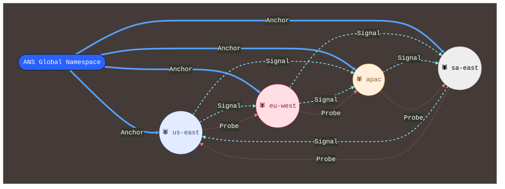

> Figure H-1: Three-core web with two Anchor and three Probe threads.

Each ANS core (the colored circles) is an independent registry running in its own region.
The lines show how the cores stay in sync and heal automatically:

|Line Type|	What it carries	|How fast	|What happens if it breaks|
|---------|-----------------|---------|--------------------------|
|Solid blue (Anchor)|	Critical data: revocations, namespace updates	|~50 ms	|Traffic is rerouted to the next healthy core in < 30 s|
|Dashed cyan (Signal)|	Routine gossip: policies, reputation scores	|~200 ms	|Automatic merge when the link comes back|
|Dotted red (Probe)|	Health-check pings	|Every 5 s	|Sick core is removed from ANS until it recovers|

In short: the web keeps working even when any single region, link, or core fails.

### H.4 Core-to-Core Protocols

#### H.4.1 Discovery

Mechanism: DNS-SD TXT records under `_ans-federation._tcp.<domain>`.
Example:

```javascript
_ans-federation._tcp.europe.example.com. 300 IN TXT \
  "core_id=eu-west" \
  "anchor_endpoint=https://ans-eu.example.com:443/anchor" \
  "signal_endpoint=https://ans-eu.example.com:443/signal" \
  "probe_endpoint=https://ans-eu.example.com:443/probe" \
  "public_key=jWK..." \
  "did=did:web:ans-eu.example.com" \
  "validator_id=val-eu-01" \
  "validator_reputation=87" \
  "reputation_source=https://reputation.example.com/eu-west.json" \
  "capabilities=revoke,namespace"
```
Cores MUST verify that federation participants are identified by either: **A DNS-bound DID (did:web)** Or **a SPIFFE identity bound to their certificate subject**.

Validator nodes MUST be rate-limited and reputation-scored using non-self-issued attestations.

#### H.4.2 Anchor Thread Protocol (ATP)

- Transport: HTTPS with mutual TLS (SPIFFE IDs).
- Payload: Signed `AnchorPacket` protobuf, extended with `sequence_number` and optional replay flags.
- Consistency: Quorum acknowledgement (≥ ½ peers).
- Failure handling: exponential back-off + circuit breaker.
- Sequence: Monotonically increasing `sequence_number` per core, included in each packet.
- Replay Support: Upon reconnection, a peer may request missing packets using `ReplayRequest`.
- Recovery: Anchor history MUST be stored for at least `T = 72h` for replay on demand.

#### H.4.3 Signal Thread Protocol (STP)

- Transport: gRPC streaming.
- Payload: Signed CRDT delta frames. Each `DeltaFrame` MUST include:
    - `timestamp`
    - `core_id`
    - `signature` over payload + timestamp
    - `validator_id` (if applicable)
- Consistency: eventual (monotonic join).
- Conflict resolution: last-writer-wins with validator-weighted merge.
- Security: Receiving cores MUST verify all signatures and timestamps (< 5 min skew) before merging.
- Replay Protection: DeltaFrames with duplicate nonces or timestamps MUST be discarded.

#### H.4.4 Probe Thread Protocol (PTP)

- Transport: `HTTP GET /probe?nonce="<rand>"` returning signed JSON:

```json
{
  "core_id": "us-east",
  "nonce": 123456,
  "block_height": 15783922,
  "signature": "0xabc..."
}
```

- Failure: 3 consecutive misses ⇒ mark unhealthy, drain traffic.

### H.5 Auto-Healing Engine (AHE)

|Component|	Trigger|	Action |	SLA |
|---------|---------|-------|----|
|Link Monitor|	latency_p99 > 50 ms OR loss > 5 %	|Switch to secondary path	| < 30 s|
|Gossip Reconciler|	CRDT fork > 2 versions |	3-way merge + replay	| < 200 ms|
|Health Prober|	3 missed probes	| Remove from DNS-SD + reroute	| < 10 s|
|Release Molter|	Canary error-rate > 1 | %	Blue/green rollback	| < 10 s|
|Backup Promoter|	Region outage detected|	Promote cold storage	| < 60 s|

### H.6 Policy & Governance

1. Policy Conflict Resolution

    ```json
    // Example
    {
      "conflict_policy": {
        "default": "deny",
        "on_missing_fields": "deny",
        "on_reputation_mismatch": "defer_to_higher_weight"
      }
    }
    
    ```

      - If `coreA` allows federation with `coreB` but `coreB` denies `coreA`, the link MUST NOT activate.
      - Tie-breaking rules (e.g., based on validator weight or latency) MAY be defined but default is to deny.
  
2. Federation Policy DSL

    ```json
    {
      "allow_cores": ["*.example.com"],
      "max_latency_ms": 50,
      "min_validators": 2,
      "data_classes": ["revocation", "namespace"],
      "encrypt": true,
      "capability_merge_sla": {
        "revocation": 500,
        "namespace": 1000,
        "policy": 1500
      }
    }
    ```

    `capability_merge_sla` defines maximum merge delay targets (in ms) per capability class across the federation.

3. Validator Weighting

    ```go
    weight = log2(reputation + 1)
    ```

4. Slashing

      - Malicious gossip: -20 % reputation
      - Repeated link drops: -5 % reputation

### H.7 Message Schema

```protobuf

syntax = "proto3";
package ans.federation.v1;

message AnchorPacket {
  string from_core = 1;
  string to_core   = 2;
  uint64 nonce     = 3;
  bytes payload_hash = 4;
  bytes signature  = 5;
  oneof payload {
    RevocationEvent revoke = 10;
    NamespaceUpdate namespace = 11;
    ValidatorHeartbeat vhb = 12;
  }
}

message RevocationEvent {
  string agent_id = 1;
  string reason   = 2;
  uint64 block    = 3;
}

message NamespaceUpdate {
  string fqdn     = 1;
  repeated string capabilities = 2;
}
```

### H.8 Deployment Blueprint (Terraform Snippet)

```hcl

module "ans_federation" {
  source  = "gclouds/ans-federation/google"
  version = "~> 0.1.1"

  cores = {
    us-east = { region = "us-east4", asn = 65001 }
    eu-west = { region = "europe-west2", asn = 65002 }
    apac    = { region = "asia-southeast1", asn = 65003 }
  }

  link_specs = {
    anchor_latency_ms = 50
    signal_latency_ms = 200
    probe_interval_s  = 5
  }

  security = {
    cert_issuer       = "spiffe://ans-federation.example.com"
    probe_keys_pub    = ["0xabc123...", "0xdef456..."]
    key_rotation_days = 7
  }

  tls_version = "1.3"
}
```

### H.9 Compliance Matrix

| Requirement	| Met By |
|-------------|---------|
| Zero-trust  |	Mutual TLS + SPIFFE IDs |
| Data-sovereignty | Regional storage, selective replication |
| GDPR / Schrems II | Encrypted in transit + regional keys |
| Zero-downtime upgrade |	Blue/green molting |
| Auditability |	Logs in Cloud Logging + GCS |

## References

[1] Google. "A2A (Agent-to-Agent) Protocol Specification." Google AI, 2024. https://github.com/google/A2A

[2]  Anthropic, PBC. "Model Context Protocol (MCP)" 2025. https://modelcontextprotocol.io/specification/2025-03-26

[3] IBM Research. "Agent Communication Protocol (ACP) Technical Documentation." IBM Research AI, 2024. https://agentcommunicationprotocol.dev/introduction/welcome

[4] W3C. "Decentralized Identifiers (DIDs) v1.0." W3C Recommendation, July 2022. https://www.w3.org/TR/did-core/

[5] Internet Engineering Task Force. "DNS-Based Service Discovery." RFC 6763, February 2013. https://datatracker.ietf.org/doc/html/rfc6763

[6] OpenAPI Initiative. "OpenAPI Specification v3.0.0." 2017. https://spec.openapis.org/oas/v3.0.0

[7] Ethereum Foundation. "Merkle Proofs for Offline Verification." Ethereum Improvement Proposals, EIP-1186, 2018. https://eips.ethereum.org/EIPS/eip-1186

[8] Goldwasser, S., Micali, S., & Rackoff, C. "The Knowledge Complexity of Interactive Proof Systems." SIAM Journal on Computing, 18(1), 186-208, 1989.

[9] Cramer, R., Damgård, I., & Schoenmakers, B. "Proofs of Partial Knowledge and Simplified Design of Witness Hiding Protocols." Advances in Cryptology — CRYPTO '94, 174-187, 1994.

[10] NIST. "Zero-Knowledge Proofs." NIST Privacy Framework, 2023. https://csrc.nist.gov/Projects/pec/zkproof
